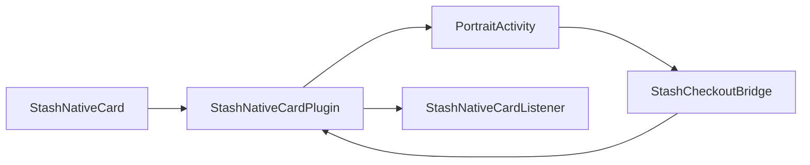
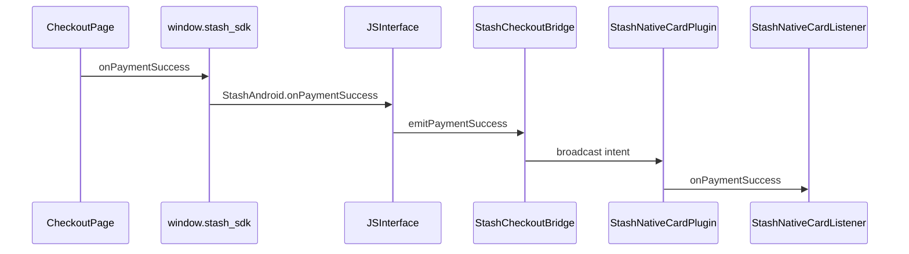
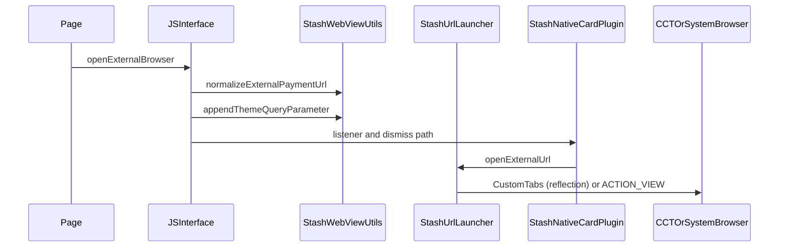
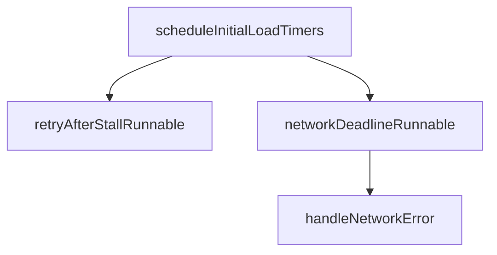

# Android Implementation

## What The Android Library Does

The Android library provides native checkout presentation and callback handling around web-based checkout content. It exposes a host-facing SDK (`StashNativeCard`) and routes checkout events through `StashNativeCardListener`.

It supports:

- Embedded checkout surfaces (card and modal).
- Popup or overlay WebView paths in the host process (`StashNativeCardPlugin`).
- Full-screen card/modal checkout in `StashNativeCardPortraitActivity` in the **host app process** (required for Unity and similar engines; avoids a second process taking foreground).
- Browser handoff (Chrome Custom Tabs or system browser).
- JS bridge under `window.stash_sdk`.
- Optional foreground short service during external browser handoff (`StashKeepAliveService`).

## Source Files (Module `Android/stashnative`)

All paths are relative to the repository root.

| Role | File |
|------|------|
| Public API and configs | [`Android/stashnative/src/main/java/com/stash/stashnative/StashNativeCard.java`](../Android/stashnative/src/main/java/com/stash/stashnative/StashNativeCard.java) |
| Host-process coordinator, popup/modal WebView, receivers | [`Android/stashnative/src/main/java/com/stash/stashnative/StashNativeCardPlugin.java`](../Android/stashnative/src/main/java/com/stash/stashnative/StashNativeCardPlugin.java) |
| Card/modal activity, timers, gestures, in-activity WebView | [`Android/stashnative/src/main/java/com/stash/stashnative/StashNativeCardPortraitActivity.java`](../Android/stashnative/src/main/java/com/stash/stashnative/StashNativeCardPortraitActivity.java) |
| JS shim string, WebView settings, URL helpers | [`Android/stashnative/src/main/java/com/stash/stashnative/StashWebViewUtils.java`](../Android/stashnative/src/main/java/com/stash/stashnative/StashWebViewUtils.java) |
| External URLs: Custom Tabs (reflection) or `ACTION_VIEW` | [`Android/stashnative/src/main/java/com/stash/stashnative/StashUrlLauncher.java`](../Android/stashnative/src/main/java/com/stash/stashnative/StashUrlLauncher.java) |
| Package-local broadcast bridge (activity to plugin) | [`Android/stashnative/src/main/java/com/stash/stashnative/StashCheckoutBridge.java`](../Android/stashnative/src/main/java/com/stash/stashnative/StashCheckoutBridge.java) |
| Actions, extras, timing constants | [`Android/stashnative/src/main/java/com/stash/stashnative/CardConstants.java`](../Android/stashnative/src/main/java/com/stash/stashnative/CardConstants.java) |
| Foreground keep-alive | [`Android/stashnative/src/main/java/com/stash/stashnative/StashKeepAliveService.java`](../Android/stashnative/src/main/java/com/stash/stashnative/StashKeepAliveService.java) |
| Background color / luminance for theme | [`Android/stashnative/src/main/java/com/stash/stashnative/StashBackgroundColorUtils.java`](../Android/stashnative/src/main/java/com/stash/stashnative/StashBackgroundColorUtils.java) |
| Manifest: activity, service | [`Android/stashnative/src/main/AndroidManifest.xml`](../Android/stashnative/src/main/AndroidManifest.xml) |

Supporting UI helpers: [`TopRoundedFrameLayout.java`](../Android/stashnative/src/main/java/com/stash/stashnative/TopRoundedFrameLayout.java), [`SpringInterpolator.java`](../Android/stashnative/src/main/java/com/stash/stashnative/SpringInterpolator.java).

Sample integration: [`Android/sample/src/main/java/com/stash/stashnative/sample/MainActivity.java`](../Android/sample/src/main/java/com/stash/stashnative/sample/MainActivity.java).

## Entry Points And API Surface

Implemented on [`StashNativeCard`](../Android/stashnative/src/main/java/com/stash/stashnative/StashNativeCard.java):

- `setActivity(Activity activity)` — required before opening UI; forwards to [`StashNativeCardPlugin`](../Android/stashnative/src/main/java/com/stash/stashnative/StashNativeCardPlugin.java).
- `setListener(StashNativeCardListener listener)` — see listener methods in the same file.
- `openCard`, `openModal`, `openPopup` (and overloads with `CardConfig`, `ModalConfig`, `PopupSizeConfig`).
- `openBrowser(String url)` — host-triggered external browser path.
- `dismiss()`, `resetPresentationState()`.
- Keep-alive: `setKeepAliveEnabled`, `setKeepAliveConfig` — consumed when starting browser handoff in the plugin (see `startKeepAliveBeforeBrowser` in [`StashNativeCardPlugin.java`](../Android/stashnative/src/main/java/com/stash/stashnative/StashNativeCardPlugin.java)).

## Injection And Bridge Model

The injected script is the string constant `JS_SDK_SCRIPT` in [`StashWebViewUtils.java`](../Android/stashnative/src/main/java/com/stash/stashnative/StashWebViewUtils.java). It defines `window.stash_sdk.*` and calls into the JavaScript interface name `StashAndroid` (`JS_INTERFACE_NAME`).

For checkout page authors, see the consolidated web API reference: [JavaScript `stash_sdk` API](./stash-sdk-js.md).

| JS function | Typical native target |
|-------------|------------------------|
| `onPaymentSuccess(order)` | `StashAndroid.onPaymentSuccess` |
| `onPaymentFailure(data)` | `StashAndroid.onPaymentFailure` |
| `onPurchaseProcessing(data)` | `StashAndroid.onPurchaseProcessing` |
| `onProcessingCompleted(data)` | `StashAndroid.onProcessingCompleted` |
| `setPaymentChannel(optinType)` | `StashAndroid.setPaymentChannel` |
| `expand()` | `StashAndroid.expand` |
| `collapse()` | `StashAndroid.collapse` |
| `openExternalBrowser(url)` | `StashAndroid.openExternalBrowser` |
| `window.close()` | `StashAndroid.requestCloseFromPage` |

`@JavascriptInterface` implementations:

- [`StashNativeCardPlugin.StashJavaScriptInterface`](../Android/stashnative/src/main/java/com/stash/stashnative/StashNativeCardPlugin.java) — popup/modal WebView in host process.
- [`StashNativeCardPortraitActivity.JSInterface`](../Android/stashnative/src/main/java/com/stash/stashnative/StashNativeCardPortraitActivity.java) — WebView inside portrait activity (same process as host).

Method names on the Java side must match the strings emitted by `JS_SDK_SCRIPT` (for example `.openExternalBrowser(...)` in the script).

## Architecture And Process Model

- [`StashNativeCard`](../Android/stashnative/src/main/java/com/stash/stashnative/StashNativeCard.java) is the singleton facade the app holds.
- [`StashNativeCardPlugin`](../Android/stashnative/src/main/java/com/stash/stashnative/StashNativeCardPlugin.java) runs in the app process, registers for [`StashCheckoutBridge`](../Android/stashnative/src/main/java/com/stash/stashnative/StashCheckoutBridge.java) intents, and starts [`StashNativeCardPortraitActivity`](../Android/stashnative/src/main/java/com/stash/stashnative/StashNativeCardPortraitActivity.java) for card and modal flows. Portrait activity shares the host process by default ([`AndroidManifest.xml`](../Android/stashnative/src/main/AndroidManifest.xml)).

## Runtime Callback Sequence (Portrait Activity Path)

When checkout runs in [`StashNativeCardPortraitActivity`](../Android/stashnative/src/main/java/com/stash/stashnative/StashNativeCardPortraitActivity.java), JS callbacks are delivered through [`StashCheckoutBridge.emitPaymentSuccess`](../Android/stashnative/src/main/java/com/stash/stashnative/StashCheckoutBridge.java) (and siblings) to the plugin’s `BroadcastReceiver`, then to `StashNativeCardListener` — the same pattern as before, but typically **in-process** (broadcasts remain the stable contract between activity and plugin).

Dispatch implementation: `dispatchCheckoutBridgeIntent` and related methods in [`StashNativeCardPlugin.java`](../Android/stashnative/src/main/java/com/stash/stashnative/StashNativeCardPlugin.java).

## External Browser Flow

Triggers:

- Page: `openExternalBrowser` in `JS_SDK_SCRIPT` ([`StashWebViewUtils.java`](../Android/stashnative/src/main/java/com/stash/stashnative/StashWebViewUtils.java)).
- Host: `StashNativeCard.openBrowser` → plugin `openBrowser`.

Shared helpers: [`StashWebViewUtils`](../Android/stashnative/src/main/java/com/stash/stashnative/StashWebViewUtils.java) (`normalizeExternalPaymentUrl`, `appendThemeQueryParameter`, legacy `isChromeCustomTabsAvailable` / `openInSystemBrowser` delegating to the launcher). URL launch: [`StashUrlLauncher.openExternalUrl`](../Android/stashnative/src/main/java/com/stash/stashnative/StashUrlLauncher.java) — when the context is an `Activity` and Custom Tabs are used, launches via `startActivityForResult` (`CardConstants.REQUEST_CODE_STASH_CUSTOM_TAB`); the result is consumed internally by [`StashNativeBrowserProxyActivity`](../Android/stashnative/src/main/java/com/stash/stashnative/StashNativeBrowserProxyActivity.java); hosts do not forward anything. Otherwise tries `launchUrl` / `startActivity`, or `Intent.ACTION_VIEW`. Hosts do not need to depend on `androidx.browser`.

Keep-alive: [`StashKeepAliveService`](../Android/stashnative/src/main/java/com/stash/stashnative/StashKeepAliveService.java), started from the plugin via `startKeepAliveBeforeBrowser` where configured.

**Manual checks (no automated test in-repo yet):**

| Setup | Expected |
|-------|----------|
| App without `androidx.browser` on the classpath | `openExternalUrl` uses `ACTION_VIEW`; no `NoClassDefFoundError`. |
| App with `androidx.browser` and a default Custom Tabs provider | Custom Tab opens for http(s) URLs. |
| Browser classes present but no activity handles the URL | Reflection or `startActivity` fails gracefully; falls back or logs; no crash. |

## Presentation Modes And UX Behavior

- Card and modal layouts, drag, expand/collapse: [`StashNativeCardPortraitActivity.java`](../Android/stashnative/src/main/java/com/stash/stashnative/StashNativeCardPortraitActivity.java) (`createCard`, `createModal`, `animateExpand`, `animateCollapse`, touch listeners).
- Popup overlay in host process: [`StashNativeCardPlugin.java`](../Android/stashnative/src/main/java/com/stash/stashnative/StashNativeCardPlugin.java) (`setupPopupWebView`, overlay drag handling — search `CheckoutOverlay` / `Drag` in that file).

## Error Handling And Recovery

Primary implementation in [`StashNativeCardPortraitActivity`](../Android/stashnative/src/main/java/com/stash/stashnative/StashNativeCardPortraitActivity.java):

- `scheduleInitialLoadTimers` — stall retry and hard deadline.
- `handleNetworkError` — user-visible error and bridge emission.
- `WebViewClient` / `onReceivedError` / `onReceivedHttpError` for main-frame failures.
- `onRenderProcessGone` — recovery path into `handleNetworkError` or cleanup.

Host-process WebView: `handleWebViewRenderProcessGone` in [`StashNativeCardPlugin.java`](../Android/stashnative/src/main/java/com/stash/stashnative/StashNativeCardPlugin.java).

## Theming

- `effectiveDarkThemeForCheckout` and related helpers in [`StashWebViewUtils.java`](../Android/stashnative/src/main/java/com/stash/stashnative/StashWebViewUtils.java).
- Optional sheet background parsing: [`StashBackgroundColorUtils.java`](../Android/stashnative/src/main/java/com/stash/stashnative/StashBackgroundColorUtils.java).

## Maintenance Notes

- Bridge contract must stay aligned across:
  - [`JS_SDK_SCRIPT`](../Android/stashnative/src/main/java/com/stash/stashnative/StashWebViewUtils.java)
  - `@JavascriptInterface` method names in [`StashNativeCardPlugin.java`](../Android/stashnative/src/main/java/com/stash/stashnative/StashNativeCardPlugin.java) and [`StashNativeCardPortraitActivity.java`](../Android/stashnative/src/main/java/com/stash/stashnative/StashNativeCardPortraitActivity.java)
  - [`.github/test/index.html`](../.github/test/index.html)
- Broadcast contract: action strings and extras in [`CardConstants.java`](../Android/stashnative/src/main/java/com/stash/stashnative/CardConstants.java) and emit helpers in [`StashCheckoutBridge.java`](../Android/stashnative/src/main/java/com/stash/stashnative/StashCheckoutBridge.java).
