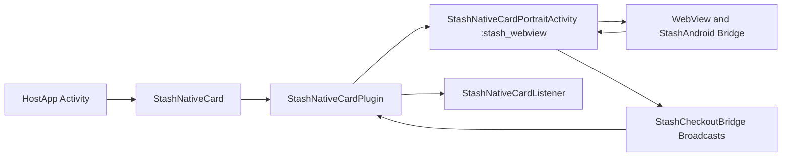
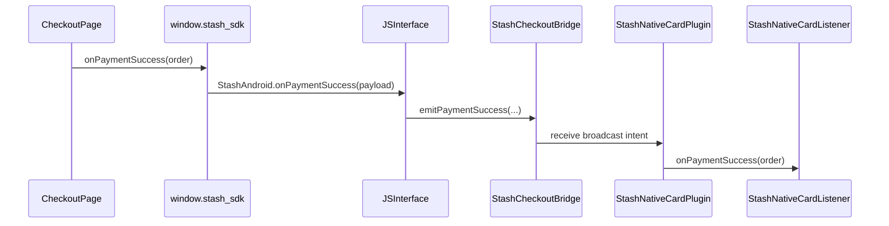
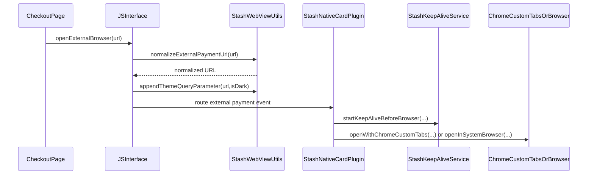
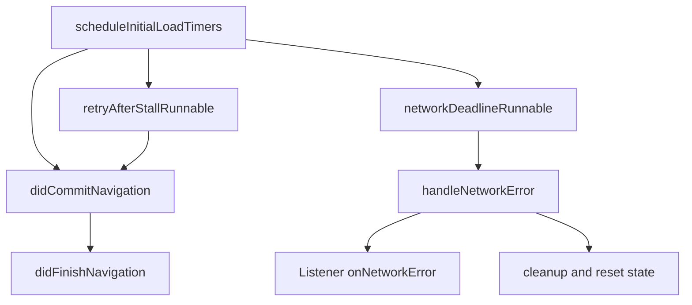

# Android Implementation

## What The Android Library Does

The Android library provides native checkout presentation and callback handling around web-based checkout content. It exposes a host-facing SDK (`StashNativeCard`) and routes checkout events through native listeners.

It supports:

- Embedded checkout surfaces (card and modal).
- Popup/card layout behavior and expand/collapse gestures.
- Browser handoff flows.
- JS bridge events from `window.stash_sdk`.
- Optional keep-alive foreground service during external browser handoff.

## Core Components

- `StashNativeCard`: public entry API and configuration surface.
- `StashNativeCardPlugin`: internal runtime coordinator in host process.
- `StashNativeCardPortraitActivity`: isolated checkout activity (`:stash_webview` process).
- `StashCheckoutBridge`: broadcast bridge between isolated activity and host process.
- `StashWebViewUtils`: WebView setup, JS SDK injection, URL normalization, browser launch helpers.
- `StashKeepAliveService`: optional foreground short service for process survivability.
- `CardConstants`: event/action names and runtime constants.

## Entry Points And API Surface

Main host entry points are implemented in `StashNativeCard`:

- `setActivity(Activity activity)`
- `setListener(StashNativeCardListener listener)`
- `openCard(String url)` and config overloads
- `openModal(String url)` and config overloads
- `openPopup(String url)` and config overloads
- `openBrowser(String url)`
- `dismiss()`
- `resetPresentationState()`
- keep-alive controls: `setKeepAliveEnabled`, `setKeepAliveConfig`

## Injection And Bridge Model

The SDK injects JavaScript under `window.stash_sdk` and maps calls to `@JavascriptInterface` methods.

Injected bridge functions include:

- `onPaymentSuccess(order)`
- `onPaymentFailure(data)`
- `onPurchaseProcessing(data)`
- `setPaymentChannel(optinType)`
- `expand()`
- `collapse()`
- `openExternalBrowser(url)`
- `window.close()`

Android interface binding details:

- JS interface name: `StashAndroid`
- Script source: `StashWebViewUtils.JS_SDK_SCRIPT`
- Implementations:
  - `StashNativeCardPlugin.StashJavaScriptInterface`
  - `StashNativeCardPortraitActivity.JSInterface`

## Architecture And Process Model

## Runtime Callback Sequence

## External Browser Flow

`openExternalBrowser(url)` can originate from page JS or host API `openBrowser(url)`.

Processing stages:

1. URL validation and normalization via `normalizeExternalPaymentUrl`.
2. Theme propagation with `appendThemeQueryParameter`.
3. Listener callback (`onExternalPayment(url)`).
4. Browser launch (`openWithChromeCustomTabs` or fallback `openInSystemBrowser`).
5. Optional keep-alive service before handoff.

## Presentation Modes And UX Behavior

- Card mode: bottom-sheet style checkout with expand/collapse behavior.
- Modal mode: centered/full-screen style overlay by configuration.
- Popup mode: configurable popup dimensions (legacy/custom sizing options).
- Orientation and gesture handling is implemented primarily in `StashNativeCardPortraitActivity` and plugin touch handlers.

## Error Handling And Recovery

Implemented resilience mechanisms:

- Initial load timers and stall retry (`scheduleInitialLoadTimers`).
- Hard network deadline fallback to network error callback.
- Main-frame HTTP and navigation error handling.
- WebView render-process-gone handling and cleanup.
- Presentation state cleanup on process death and host lifecycle resume.

## Theming

- Effective theme is derived from app/system conditions and optional custom background.
- External URLs may include `theme=dark` or `theme=light`.
- Theme handling utility methods are centralized in `StashWebViewUtils`.

## Maintenance Notes

- Isolated process flow depends on manifest declarations in `AndroidManifest.xml`.
- Broadcast bridge actions and extra keys are defined in `CardConstants`.
- Any change to JS bridge method names must be kept consistent across:
  - `JS_SDK_SCRIPT`
  - `@JavascriptInterface` method names
  - test harness page `.github/test/index.html`
