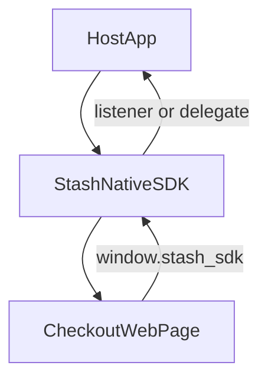
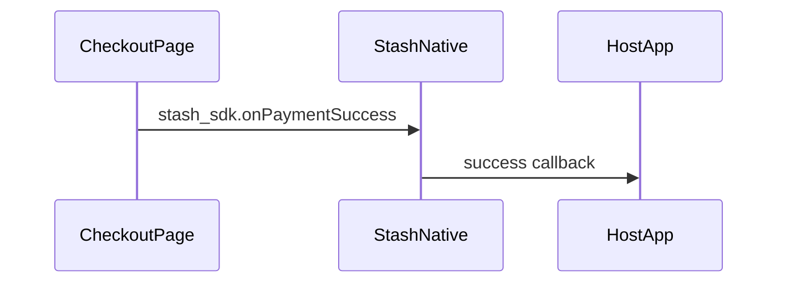
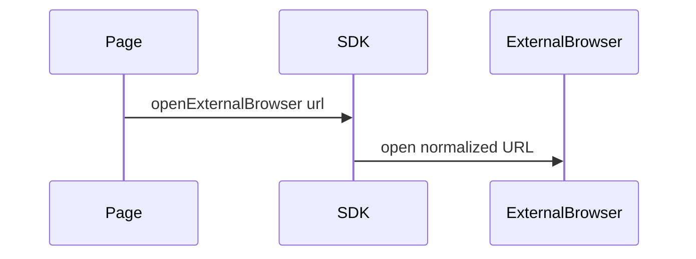

# Architecture Overview

## What The Library Does

Stash Native is a mobile checkout SDK that embeds checkout web content in native UI and exposes a native-JavaScript bridge for payment events and UI actions.

Primary responsibilities:

- Render checkout content in native containers (`WebView` on Android, `WKWebView` on iOS).
- Inject `window.stash_sdk` bridge functions into the checkout page.
- Forward checkout events to host application callbacks/delegates.
- Support card, modal, and browser-based flows.
- Support controlled handoff to external browser with URL normalization and theme propagation.

## Repository Map (Where To Read Code)

| Area | Path |
|------|------|
| Android public API | [`Android/stashnative/src/main/java/com/stash/stashnative/StashNativeCard.java`](../Android/stashnative/src/main/java/com/stash/stashnative/StashNativeCard.java) |
| Android host runtime | [`Android/stashnative/src/main/java/com/stash/stashnative/StashNativeCardPlugin.java`](../Android/stashnative/src/main/java/com/stash/stashnative/StashNativeCardPlugin.java) |
| Android isolated checkout activity | [`Android/stashnative/src/main/java/com/stash/stashnative/StashNativeCardPortraitActivity.java`](../Android/stashnative/src/main/java/com/stash/stashnative/StashNativeCardPortraitActivity.java) |
| Android JS injection and WebView helpers | [`Android/stashnative/src/main/java/com/stash/stashnative/StashWebViewUtils.java`](../Android/stashnative/src/main/java/com/stash/stashnative/StashWebViewUtils.java) |
| Android process bridge | [`Android/stashnative/src/main/java/com/stash/stashnative/StashCheckoutBridge.java`](../Android/stashnative/src/main/java/com/stash/stashnative/StashCheckoutBridge.java) |
| Android manifest (isolated process, services) | [`Android/stashnative/src/main/AndroidManifest.xml`](../Android/stashnative/src/main/AndroidManifest.xml) |
| iOS public API | [`iOS/StashNative/Sources/StashNative/include/StashNativeCard.h`](../iOS/StashNative/Sources/StashNative/include/StashNativeCard.h) |
| iOS core implementation | [`iOS/StashNative/Sources/StashNative/StashNativeCard.m`](../iOS/StashNative/Sources/StashNative/StashNativeCard.m) |
| iOS navigation and load errors | [`iOS/StashNative/Sources/StashNative/StashNativeCardWebViewDelegates.m`](../iOS/StashNative/Sources/StashNative/StashNativeCardWebViewDelegates.m) |
| iOS presentation controllers | [`iOS/StashNative/Sources/StashNative/StashNativeCardViewControllers.m`](../iOS/StashNative/Sources/StashNative/StashNativeCardViewControllers.m) |
| iOS SPM package | [`iOS/StashNative/Package.swift`](../iOS/StashNative/Package.swift) |
| Root integration notes | [`README.md`](../README.md) |

## High-Level Runtime (Both Platforms)

One mental model applies to Android and iOS: the host app drives the SDK; the SDK owns the embedded web surface and forwards page events back to the app.

Android implements `Sdk` as [`StashNativeCard`](../Android/stashnative/src/main/java/com/stash/stashnative/StashNativeCard.java) plus [`StashNativeCardPlugin`](../Android/stashnative/src/main/java/com/stash/stashnative/StashNativeCardPlugin.java) and, for the default card path, [`StashNativeCardPortraitActivity`](../Android/stashnative/src/main/java/com/stash/stashnative/StashNativeCardPortraitActivity.java). iOS implements it in [`StashNativeCard`](../iOS/StashNative/Sources/StashNative/StashNativeCard.m) (Objective-C singleton) with presentation split into [`StashNativeCardViewControllers.m`](../iOS/StashNative/Sources/StashNative/StashNativeCardViewControllers.m).

## Injection Model Per Platform

### Android

- Bridge script: constant `JS_SDK_SCRIPT` in [`StashWebViewUtils.java`](../Android/stashnative/src/main/java/com/stash/stashnative/StashWebViewUtils.java).
- JS object exposed to the page: `StashAndroid` via `JS_INTERFACE_NAME` in the same file.
- Injected namespace: `window.stash_sdk`.
- `@JavascriptInterface` implementations:
  - Inner class in [`StashNativeCardPlugin.java`](../Android/stashnative/src/main/java/com/stash/stashnative/StashNativeCardPlugin.java) (`StashJavaScriptInterface`).
  - Inner class in [`StashNativeCardPortraitActivity.java`](../Android/stashnative/src/main/java/com/stash/stashnative/StashNativeCardPortraitActivity.java) (`JSInterface`).
- Injection call sites: search `evaluateJavascript` / `JS_SDK_SCRIPT` / `injectStashSDK` in the plugin and portrait activity.

### iOS

- Bridge script: built as an `NSString` in [`StashNativeCard.m`](../iOS/StashNative/Sources/StashNative/StashNativeCard.m) and installed with `WKUserScript` at document start.
- Native side: `userContentController:didReceiveScriptMessage:` in the same file registers and handles named handlers (for example `stashExternalPayment`).
- Injected namespace: `window.stash_sdk`.
- Handler name constants (for example `kMessageHandlerExternalPayment`) are defined near the top of [`StashNativeCard.m`](../iOS/StashNative/Sources/StashNative/StashNativeCard.m).

## Shared Feature Surface

- Payment result callbacks.
- Purchase processing signal.
- Opt-in or payment channel signal (`setPaymentChannel`).
- Presentation controls (`expand`, `collapse`, `window.close` override).
- External browser launch (`openExternalBrowser(url)`).
- Theme-aware URL propagation (`theme=dark|light`); see `appendThemeQueryParameter` on each platform ([`StashWebViewUtils`](../Android/stashnative/src/main/java/com/stash/stashnative/StashWebViewUtils.java), [`StashNativeCard.m`](../iOS/StashNative/Sources/StashNative/StashNativeCard.m)).

## Payment Event Flow (Simplified)

Concrete routing differs by platform: Android may use [`StashCheckoutBridge`](../Android/stashnative/src/main/java/com/stash/stashnative/StashCheckoutBridge.java) when the WebView runs in `:stash_webview`. See [Android Implementation](./android.md) and [iOS Implementation](./ios.md).

## External Browser (Simplified)

Listener or delegate notification and dismissal ordering are specified in [`StashNativeCard.java`](../Android/stashnative/src/main/java/com/stash/stashnative/StashNativeCard.java) (listener contract) and [`StashNativeCard.h`](../iOS/StashNative/Sources/StashNative/include/StashNativeCard.h) (`stashNativeCardDidRequestExternalPaymentWithURL:`).

## Platform Deep Dives

- [Android Implementation](./android.md) — file-by-file map, process model, bridge tables.
- [iOS Implementation](./ios.md) — handlers, presentation entry points, load delegate.
- [Maintenance and Testing](./maintenance-and-testing.md) — CI, local commands, QA harnesses.
