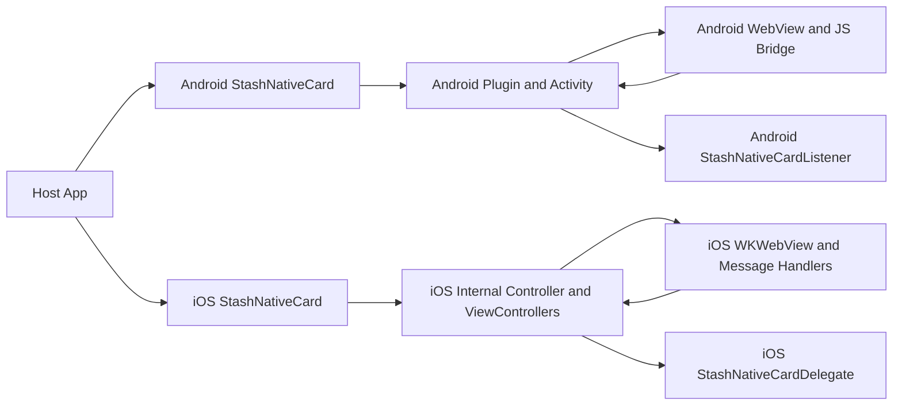
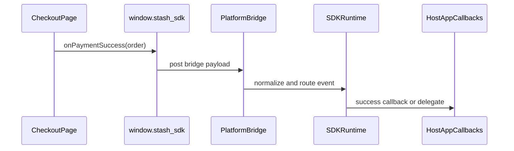
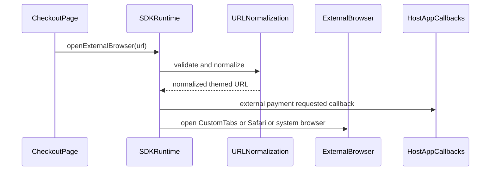

# Architecture Overview

## What The Library Does

Stash Native is a mobile checkout SDK that embeds checkout web content in native UI and exposes a native-JavaScript bridge for payment events and UI actions.

Primary responsibilities:

- Render checkout content in native containers (`WebView` on Android, `WKWebView` on iOS).
- Inject `window.stash_sdk` bridge functions into the checkout page.
- Forward checkout events to host application callbacks/delegates.
- Support card, modal, and browser-based flows.
- Support controlled handoff to external browser with URL normalization and theme propagation.

## High-Level Platform Architecture

## Injection Model Per Platform

### Android

- Bridge script source: `StashWebViewUtils.JS_SDK_SCRIPT`.
- Native JS interface object name: `StashAndroid` (`JS_INTERFACE_NAME`).
- Injected namespace: `window.stash_sdk`.
- Bridge target methods are implemented in `@JavascriptInterface` classes:
  - `StashNativeCardPlugin.StashJavaScriptInterface`
  - `StashNativeCardPortraitActivity.JSInterface`

### iOS

- Bridge script is built in `StashNativeCard.m` and injected via `WKUserScript`.
- JS-to-native communication uses `window.webkit.messageHandlers.<handler>.postMessage(...)`.
- Message handlers are processed in `userContentController:didReceiveScriptMessage:`.
- Injected namespace: `window.stash_sdk`.

## Shared Feature Surface

- Payment result callbacks.
- Purchase processing signal.
- Opt-in/payment channel signal.
- Presentation controls (`expand`, `collapse`, `window.close` override).
- External browser launch (`openExternalBrowser(url)`).
- Theme-aware URL propagation (`theme=dark|light`).

## Runtime Event Flow

## External Browser Infrastructure

## Platform Deep Dives

- Android details: [Android Implementation](./android.md)
- iOS details: [iOS Implementation](./ios.md)
- Build, lint, release, and QA practices: [Maintenance and Testing](./maintenance-and-testing.md)
