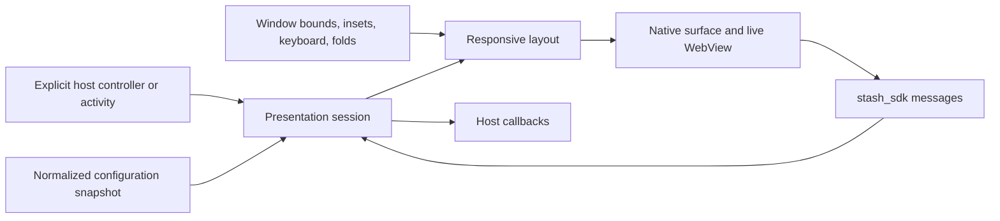

# Architecture and repository map

Stash Native embeds checkout in a platform WebView and presents it as a responsive card. Browser presentation uses Safari on iOS and Custom Tabs/system browser on Android. Payment fulfilment belongs to the integrating backend.

## Source map

| Area | Location and responsibility |
|---|---|
| iOS facade | `iOS/StashNative/Sources/StashNative/StashNativeCard.m`: explicit presenter, active session, public operations |
| iOS configuration and geometry | `StashNativeCardConfigs.m`, `StashNativeCardGeometry.m`: snapshots, normalization, safe-region sizing |
| iOS session | `StashNativeCardInternal.m`, `StashNativeCardPrivate.h`: WebView, callbacks, document identity, dismissal and processing state |
| iOS presentation | `StashNativeCardViewControllers.m`: one native card sheet implementation, keyboard and layout changes |
| iOS web support | `StashNativeCardViewUtils.m`, `StashNativeCardWebViewDelegates.m`, `StashNativeCardTheme.m`: injection, navigation, loading, theme |
| Android facade/plugin | `Android/stashnative/src/main/java/com/stash/stashnative/`: `StashNativeCard`, `StashNativeCardPlugin`; API dispatch, active presentation and browser lifecycle |
| Android presentation | Checkout activity, `StashPresentationController`, `StashPresentationState`, `StashCheckoutSizing`, `StashSheetLayout`; window layout, gestures, state and rendering |
| Android web support | `StashCheckoutWebViewSupport`, `StashCheckoutJsInterface`, `StashContentSizeSupport`, `StashWebInteractionSupport`, `StashWebViewUtils`; loading, bridge, navigation, native form interactions and card measurements |
| Android integration | `StashWindowCompat`, `StashUrlLauncher`, `StashCheckoutBridge`, browser proxy and engagement helpers; insets, external URLs and same-process callbacks |
| Samples | `iOS/Sample`, `Android/sample`: configuration, test link generation, callback examples |
| Tests | iOS SPM tests/regression support, Android JUnit/Robolectric tests, `.github/test` web fixtures, `Android/modern-host` standalone-AAR host |
| Distribution | Root/nested SPM manifests, iOS Xcode project, Android Gradle modules, `.github/workflows` |

Desktop development lives separately on `desktop/integration`. Its shared C++ session and macOS/Windows hosts have their own ABI and sizing policy. They are not part of this mobile 3.0 change.

## Presentation flow

```mermaid
flowchart LR
    Host[Explicit host controller or activity] --> Session[Presentation session]
    Config[Normalized configuration snapshot] --> Session
    Window[Window bounds, insets, keyboard, folds] --> Layout[Responsive layout]
    Session --> Layout
    Layout --> Surface[Native surface and live WebView]
    Surface --> Bridge[stash_sdk messages]
    Bridge --> Session
    Session --> Callbacks[Host callbacks]
```

One active session owns the presentation. Geometry changes update that session and its WebView; they do not create a new checkout or duplicate payment callbacks. A card tracks resting/expanded state independently of physical height.

The card's optional content reporter is document-scoped. Width changes invalidate old measurements. The public JS API is the same on both platforms; native transport and callback interfaces differ. The exact contract is in [stash-sdk-js.md](stash-sdk-js.md).

## Maintainer entry points

Read [responsive presentation](responsive-presentation.md) for geometry and content measurement, then the [iOS](ios.md) or [Android](android.md) implementation guide. Use [maintenance and testing](maintenance-and-testing.md) for build contexts and validation limits. Public API breaks are collected in [migration to 3.0](migration-3.0.md).
