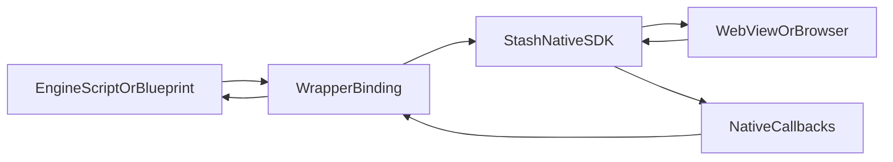

# Building Wrappers for Stash Native

## Purpose and Scope

A **wrapper** is a thin layer that sits above the Stash Native SDK (Android AAR and iOS XCFramework) and exposes checkout APIs in a game engine or application framework (C#, Blueprints, GDScript, custom C++, and so on).

This document describes **integration patterns and responsibilities** for authors building or maintaining such wrappers. It does not replace:

- Product API details in the repository [README](../README.md) (presentation modes, callbacks, installation).
- Implementation specifics inside each wrapper repository (Unity package layout, Unreal module rules, and so on).

Wrappers should remain **thin**: forward calls to the native SDK, respect UI-thread and lifecycle rules, and map native callbacks into engine events.

## Reference Implementations

The following repositories are maintained as first-party wrappers around this library. Use them as canonical examples of JNI/Objective-C bridges, editor tooling, and lifecycle wiring.

| Engine | Repository | Compatibility |
|--------|------------|---------------|
| Unity | [stash-unity](https://github.com/stashgg/stash-unity) | Unity 2019.4+ (LTS recommended) |
| Unreal Engine 5 | [stash-unreal (main)](https://github.com/stashgg/stash-unreal) | Unreal Engine 5.0+ |
| Unreal Engine 4 | [stash-unreal (4.27-plus)](https://github.com/stashgg/stash-unreal/tree/4.27-plus) | Unreal Engine 4.27+ |

The same table appears under [Game Engine Wrappers](../README.md#wrappers) in the root README.

## End-to-End Flow

## What a Wrapper Must Provide

### Binary integration

- Consume versioned artifacts from [Stash Native releases](https://github.com/stashgg/stash-native/releases): Android AAR and iOS XCFramework (or follow [Installation](../README.md#installation) for SPM/manual iOS layout).
- Pin wrapper releases to a tested `stash-native` tag so engine users get predictable behavior.

### Lifecycle

- **Android**: `StashNativeCard` requires a valid `Activity` via `setActivity` before opening UI. The wrapper must supply the foreground activity used for dialogs and WebView hosting, and refresh it when the engine transitions activities (for example after resume).
- **iOS**: Ensure the SDK runs with a sensible key window / window scene before `openCardWithURL:` / `openModalWithURL:` / `openBrowserWithURL:`. Forward application or scene lifecycle as needed so returning from Safari or Custom Tabs does not leave stale state.

### Threading

- Invoke all Stash Native APIs on the **platform UI thread** (Android main looper, iOS main queue). Game engines often call from worker or render threads; the wrapper must marshal explicitly.

### Callbacks

- Map `StashNativeCardListener` (Android) and `StashNativeCardDelegate` (iOS) to engine-native constructs (Unity events, Unreal dynamic delegates, signals, and so on). Preserve ordering and semantics documented in the [README](../README.md) callback sections.

### JavaScript contract

- Checkout pages communicate via `window.stash_sdk`. The full contract is documented in [JavaScript `stash_sdk` API](./stash-sdk-js.md); platform implementation details remain in [Android Implementation](./android.md) and [iOS Implementation](./ios.md). Wrappers **do not** redefine that web surface for production checkout. Editor-only test harnesses may call the same APIs against test URLs; keep those code paths separate from shipping builds.

## Platform-Specific Wrapper Layers

### Android

- Package the AAR and add Gradle dependencies required by the host app (for example `androidx.appcompat` as in the [README](../README.md)). `androidx.browser` is optional: add it if you want Chrome Custom Tabs for external URLs; otherwise the SDK opens the system browser.
- Initialize the singleton: `StashNativeCard.getInstance()`, then `setActivity`, `setListener`, and open methods (`openCard`, `openModal`, `openPopup`, `openBrowser`). Custom Tabs results are handled internally by the SDK's proxy activity; no `onActivityResult` forwarding is needed.
- If the engine launches checkout from native plugin code, ensure the JNI or C# layer obtains the current `Activity` from the engine’s Android entry point.

### iOS

- Embed `StashNative.xcframework` or add the Swift package URL from the [README](../README.md). Link **SafariServices** and **WebKit**.
- Set `[StashNativeCard sharedInstance]` delegate on the main thread before presenting UI.
- For engine-hosted apps, validate window attachment on device; the SDK includes logic to align with `UIWindowScene` (see comments in [`StashNativeCard.m`](../iOS/StashNative/Sources/StashNative/StashNativeCard.m) around window/scene selection and game-engine-related delays).

## Game Engine Considerations

### Rendering and UI hierarchy

Some engines use custom windows or delayed UI initialization. Stash Native assumes a normal application window hierarchy. In-repo iOS code references game engines explicitly (for example attaching the card window to the app’s `UIWindowScene`, and short delays before show to improve rendering in embedded hosts). Treat **on-device testing** as mandatory for any new wrapper.

Relevant implementation file for iOS window/scene behavior: [`iOS/StashNative/Sources/StashNative/StashNativeCard.m`](../iOS/StashNative/Sources/StashNative/StashNativeCard.m).

### Memory and object lifetime

- Avoid invoking the SDK after teardown of the engine module or activity.
- On iOS, follow singleton and session semantics described under **State Model And Safety** in [iOS Implementation](./ios.md).

### Editor versus device

Unity and Unreal wrappers often ship editor play-mode tools to exercise flows without a full game loop. If you add similar tooling:

- Use dedicated test URLs and clearly named APIs.
- Do not rely on editor-only behavior in production binaries.

## Checklist for a New Engine Wrapper

1. **Versioning**: Depend on a specific `stash-native` release artifact; document upgrade steps for engine users.
2. **Minimal bridge**: Expose `openCard` / `openModal` / `openBrowser` (and dismiss/reset if needed) plus listener/delegate mapping.
3. **UI thread**: Enforce main-thread marshaling for every SDK entry point.
4. **Smoke test**: Open card with a known test page; confirm `onPaymentSuccess` or equivalent reaches script/Blueprint.
5. **External flow**: Trigger `openExternalBrowser` (or host `openBrowser`); confirm return to app and listener behavior.
6. **Dismissal**: Verify `window.close`, user dismiss, and `dismiss` from host do not leak state or double-fire callbacks.

## Further Reading

- [Architecture Overview](./architecture-overview.md) — shared runtime model.
- [JavaScript `stash_sdk` API](./stash-sdk-js.md) — web page contract for checkout and webshop.
- [Android Implementation](./android.md) — `JS_SDK_SCRIPT`, isolated process, `StashCheckoutBridge`.
- [iOS Implementation](./ios.md) — message handlers, presentation modes, load errors.
- [Maintenance and Testing](./maintenance-and-testing.md) — building AAR/XCFramework and CI expectations.
