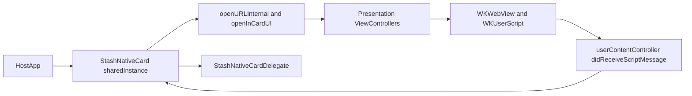
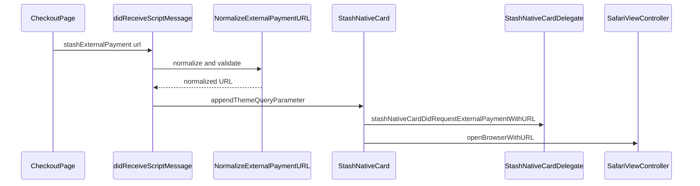
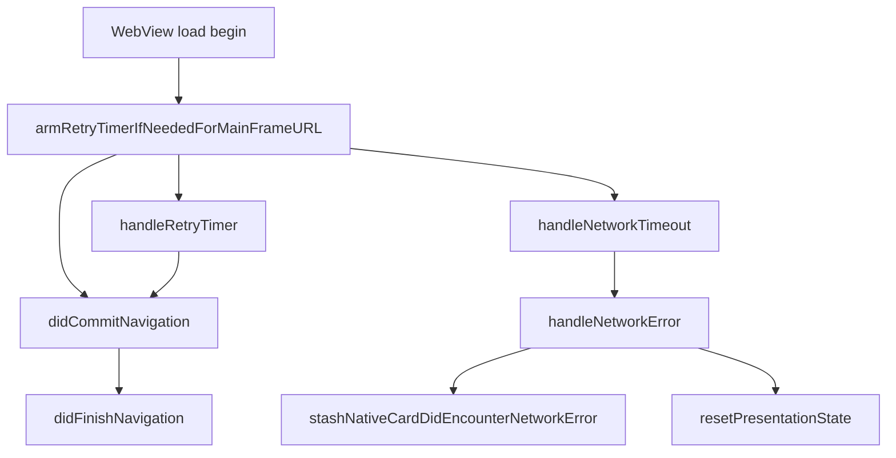

# iOS Implementation

## What The iOS Library Does

The iOS library provides a native wrapper around web-based checkout using `WKWebView`, native presentation controllers, and a JavaScript bridge under `window.stash_sdk`.

It supports:

- Checkout in card, modal, and popup presentation modes.
- Browser handoff via Safari view controller flows.
- Delegate callbacks for payment, dismissal, loading, external payment, and network errors.
- URL theming and custom background alignment.

## Core Components

- `StashNativeCard.h`: public API and delegate contract.
- `StashNativeCard.m`: singleton/runtime state, routing, JS injection, message handling, presentation entry points.
- `StashNativeCardPrivate.h`: shared private symbols and helper contracts.
- `StashNativeCardWebViewDelegates.m`: navigation/timeout/retry/error behavior.
- `StashNativeCardViewControllers.m`: platform-specific presentation and orientation controllers.

## Public API Surface

Primary entry points in `StashNativeCard`:

- `+sharedInstance`
- `-openCardWithURL:config:`
- `-openModalWithURL:config:`
- `-openPopupWithURL:sizeConfig:`
- `-openBrowserWithURL:`
- `-closeBrowser`
- `-dismissSafariViewControllerWithResult:`
- `-dismiss`
- `-resetPresentationState`

Core delegate callbacks in `StashNativeCardDelegate` include:

- `stashNativeCardDidCompletePaymentWithOrder:`
- `stashNativeCardDidFailPayment`
- `stashNativeCardDidReceiveOptIn:`
- `stashNativeCardDidDismiss`
- `stashNativeCardDidLoadPage:`
- `stashNativeCardDidRequestExternalPaymentWithURL:`
- `stashNativeCardDidEncounterNetworkError`

## Injection And Bridge Model

The bridge script is injected with `WKUserScript` and defines functions under `window.stash_sdk`.

Injected functions:

- `onPaymentSuccess(order)`
- `onPaymentFailure(data)`
- `onPurchaseProcessing(data)`
- `setPaymentChannel(optinType)`
- `expand()`
- `collapse()`
- `openExternalBrowser(url)`
- `window.close()`

JS posts to named message handlers, handled by:

- `userContentController:didReceiveScriptMessage:`

Representative handler names include:

- `stashNativementSuccess`
- `stashNativementFailure`
- `stashPurchaseProcessing`
- `stashOptin`
- `stashExpand`
- `stashCollapse`
- `stashExternalPayment`
- `stashWindowClose`
- `stashNativePageReady`

## Runtime Architecture

## Presentation Modes

Routing is handled in `openInCardUI:` and related methods:

- `presentIPhoneCardWithURL:` for forced portrait card UX.
- `presentIPhoneCardInCurrentOrientationWithURL:` for rotation-aware card UX.
- `presentiPadModalWithURL:` for iPad-specific modal behavior.
- `presentModalWithURL:` for centered modal flow.
- `presentPopupWithURL:` for popup flow.

Presentation controllers and orientation-specific behavior are implemented in `StashNativeCardViewControllers.m`.

## External Browser Flow

External browser handoff can be triggered by:

- Host API: `openBrowserWithURL:`
- Page JS: `window.stash_sdk.openExternalBrowser(url)`

Processing pipeline:

1. Message handler receives `stashExternalPayment`.
2. URL is validated by `NormalizeExternalPaymentURL`.
3. Theme parameter is appended using `appendThemeQueryParameter`.
4. Delegate is informed (`stashNativeCardDidRequestExternalPaymentWithURL:`).
5. Card UI is dismissed and Safari is opened.

## Loading, Timeout, Retry, And Error Semantics

Web loading behavior is implemented in `StashNativeCardWebViewDelegates.m`:

- Network timeout deadline (`kNetworkTimeoutInterval`).
- Retry timer (`kRetryTimeoutInterval`) with bounded retry attempts.
- Main-frame HTTP error handling (`>= 400` as failure path).
- Web content process termination handling and limited recovery.
- Foreground stale-load recovery helpers.

## Theming And Appearance

- Theme propagation is URL-based (`theme=light|dark`).
- Effective dark mode is computed using runtime helpers (including custom background color logic).
- `WKWebView` and document styling are aligned with the sheet background where required.

## State Model And Safety

- The implementation uses singleton state with presentation guards to prevent overlapping presentations.
- Session token checks are used to avoid stale callback handling.
- Dismissal/cleanup paths centralize timer and web-load termination to reduce race conditions.

## Maintenance Notes

- Keep JS function names and message handler contracts synchronized with documentation and test pages.
- For callback behavior changes, update both:
  - public header comments (`StashNativeCard.h`)
  - sample delegate usage in `iOS/Sample/StashNativeSample`
