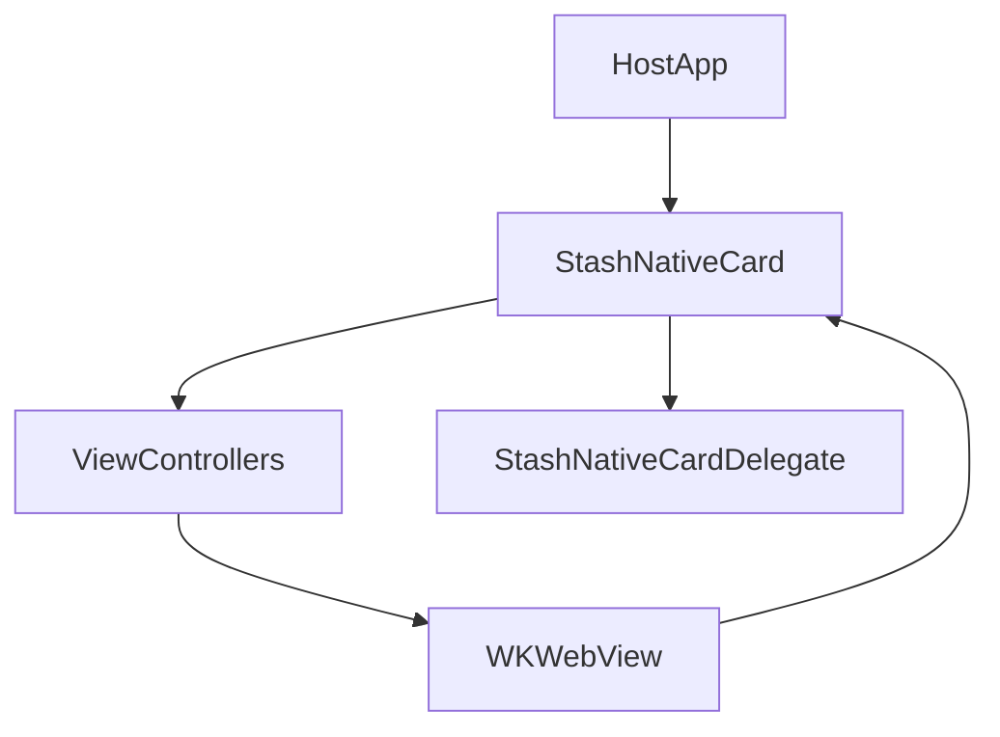
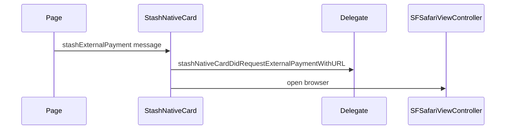
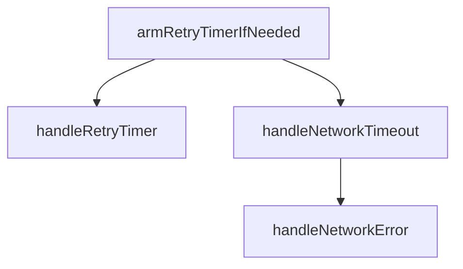

# iOS Implementation

## What The iOS Library Does

The iOS library wraps web checkout in `WKWebView`, presents it in card, modal, or popup containers, and exposes a JavaScript bridge under `window.stash_sdk`. Host apps implement `StashNativeCardDelegate` for payment, dismissal, load metrics, external payment, and network errors.

Minimum platform: see [`iOS/StashNative/Package.swift`](../iOS/StashNative/Package.swift) (`platforms`).

## Source Files (Target StashNative)

Paths relative to repository root.

| Role | File |
|------|------|
| Public API, delegate protocol, config types | [`iOS/StashNative/Sources/StashNative/include/StashNativeCard.h`](../iOS/StashNative/Sources/StashNative/include/StashNativeCard.h) |
| Singleton, routing, WKWebView factory, JS injection, message handling | [`iOS/StashNative/Sources/StashNative/StashNativeCard.m`](../iOS/StashNative/Sources/StashNative/StashNativeCard.m) |
| Private shared declarations | [`iOS/StashNative/Sources/StashNative/StashNativeCardPrivate.h`](../iOS/StashNative/Sources/StashNative/StashNativeCardPrivate.h) |
| `WKNavigationDelegate` / `WKUIDelegate`, timeouts, retries, errors | [`iOS/StashNative/Sources/StashNative/StashNativeCardWebViewDelegates.m`](../iOS/StashNative/Sources/StashNative/StashNativeCardWebViewDelegates.m) |
| Card/modal/popup view controllers, orientation | [`iOS/StashNative/Sources/StashNative/StashNativeCardViewControllers.m`](../iOS/StashNative/Sources/StashNative/StashNativeCardViewControllers.m) |
| Xcode project (library) | [`iOS/StashNative/StashNative.xcodeproj`](../iOS/StashNative/StashNative.xcodeproj) |

Sample app (Swift delegate wiring): [`iOS/Sample/StashNativeSample/StashNativeSample/ViewController+StashNativeDelegate.swift`](../iOS/Sample/StashNativeSample/StashNativeSample/ViewController+StashNativeDelegate.swift), [`ViewController+Actions.swift`](../iOS/Sample/StashNativeSample/StashNativeSample/ViewController+Actions.swift).

## Public API Surface

Declared in [`StashNativeCard.h`](../iOS/StashNative/Sources/StashNative/include/StashNativeCard.h), implemented in [`StashNativeCard.m`](../iOS/StashNative/Sources/StashNative/StashNativeCard.m):

- `+sharedInstance`
- `-openCardWithURL:config:`, `-openModalWithURL:config:`, `-openPopupWithURL:sizeConfig:`
- `-openBrowserWithURL:`, `-closeBrowser`, `-dismissSafariViewControllerWithResult:`
- `-dismiss`, `-resetPresentationState`

Delegate callbacks (same header): `stashNativeCardDidCompletePaymentWithOrder:`, `stashNativeCardDidFailPayment`, `stashNativeCardDidReceiveOptIn:`, `stashNativeCardDidDismiss`, `stashNativeCardDidLoadPage:`, `stashNativeCardDidRequestExternalPaymentWithURL:`, `stashNativeCardDidEncounterNetworkError`.

Internal routing: search `openURLInternal:` and `openInCardUI:` in [`StashNativeCard.m`](../iOS/StashNative/Sources/StashNative/StashNativeCard.m).

## Injection And Bridge Model

- Script assembly and `WKUserScript` registration: [`StashNativeCard.m`](../iOS/StashNative/Sources/StashNative/StashNativeCard.m) (search `stashSDKScript` / `WKUserScript`).
- Handler registration: `addScriptMessageHandler:name:` for each bridge channel.
- Dispatch: `userContentController:didReceiveScriptMessage:` in the same file.

Message handler name constants (examples — verify in source): defined as `static NSString * const kMessageHandler...` near the top of [`StashNativeCard.m`](../iOS/StashNative/Sources/StashNative/StashNativeCard.m).

| JS entry | Typical handler name (see source) |
|----------|-------------------------------------|
| `onPaymentSuccess` | `stashNativementSuccess` (typo preserved in codebase) |
| `onPaymentFailure` | `stashNativementFailure` |
| `onPurchaseProcessing` | `stashPurchaseProcessing` |
| `setPaymentChannel` | `stashOptin` |
| `expand` | `stashExpand` |
| `collapse` | `stashCollapse` |
| `openExternalBrowser` | `stashExternalPayment` |
| `window.close` | `stashWindowClose` |
| page ready (injected) | `stashNativePageReady` |

Always confirm exact strings in [`StashNativeCard.m`](../iOS/StashNative/Sources/StashNative/StashNativeCard.m) before changing the web contract.

## Runtime Architecture

[`StashNativeCardViewControllers.m`](../iOS/StashNative/Sources/StashNative/StashNativeCardViewControllers.m) contains `IPhoneCardViewController`, modal controllers, and orientation helpers referenced from [`StashNativeCard.m`](../iOS/StashNative/Sources/StashNative/StashNativeCard.m).

## Presentation Modes

Entry points in [`StashNativeCard.m`](../iOS/StashNative/Sources/StashNative/StashNativeCard.m) under `openInCardUI:` and related `present*` methods:

- `presentIPhoneCardWithURL:` — forced portrait card.
- `presentIPhoneCardInCurrentOrientationWithURL:` — rotation-aware card.
- `presentiPadModalWithURL:` — iPad-oriented presentation.
- `presentModalWithURL:` — centered modal.
- `presentPopupWithURL:` — popup sizing.

Layout and rotation: [`StashNativeCardViewControllers.m`](../iOS/StashNative/Sources/StashNative/StashNativeCardViewControllers.m).

## External Browser Flow

- Host: `-openBrowserWithURL:` in [`StashNativeCard.m`](../iOS/StashNative/Sources/StashNative/StashNativeCard.m) (Safari Services path).
- Page: `window.stash_sdk.openExternalBrowser(url)` posts to the external-payment handler; handled in `userContentController:didReceiveScriptMessage:`.

Pipeline (read implementation for ordering):

1. Normalize: C function `NormalizeExternalPaymentURL` in [`StashNativeCard.m`](../iOS/StashNative/Sources/StashNative/StashNativeCard.m).
2. Theme: `appendThemeQueryParameter` (same file).
3. Delegate: `stashNativeCardDidRequestExternalPaymentWithURL:` ([`StashNativeCard.h`](../iOS/StashNative/Sources/StashNative/include/StashNativeCard.h)).
4. Dismiss card UI and present Safari (see `openInSafariViewController` / related in [`StashNativeCard.m`](../iOS/StashNative/Sources/StashNative/StashNativeCard.m)).

## Loading, Timeout, Retry, And Error Semantics

Implemented in [`StashNativeCardWebViewDelegates.m`](../iOS/StashNative/Sources/StashNative/StashNativeCardWebViewDelegates.m) (`WebViewLoadDelegate` and related):

- Constants `kNetworkTimeoutInterval`, `kRetryTimeoutInterval` (file header or top of implementation).
- `armRetryTimerIfNeededForMainFrameURL`, `handleRetryTimer`, `handleNetworkTimeout`, `handleNetworkError`.
- HTTP main-frame status `>= 400` treated as failure where implemented.
- `webViewWebContentProcessDidTerminate:` — limited reload policy.
- Foreground recovery: `recoverStaleLoadAfterApplicationForegroundIfNeeded`.

Failure surface to app: `stashNativeCardDidEncounterNetworkError` and `resetPresentationState` behavior (see [`StashNativeCard.m`](../iOS/StashNative/Sources/StashNative/StashNativeCard.m) call sites from the load delegate).

## Theming And Appearance

- URL query `theme`: `appendThemeQueryParameter` in [`StashNativeCard.m`](../iOS/StashNative/Sources/StashNative/StashNativeCard.m).
- Effective dark mode: `stash_effectiveThemeIsDark` and sheet background helpers in the same file.
- Dark document injection: search `StashNativeDarkSheetBackgroundJavaScript` / `StashNativeSheetUsesDarkWebTheme` in [`StashNativeCard.m`](../iOS/StashNative/Sources/StashNative/StashNativeCard.m).

## State Model And Safety

- Presentation guards and flags: search `_isCardCurrentlyPresented`, `_paymentSuccessHandled` in [`StashNativeCard.m`](../iOS/StashNative/Sources/StashNative/StashNativeCard.m).
- Session token: `presentationSessionToken` / `StashNativeCurrentPresentationSessionToken()` to drop stale callbacks after teardown.
- Centralized teardown: `beginDismissStoppingLoadAndTimers`, `cleanupCardInstance` in [`StashNativeCard.m`](../iOS/StashNative/Sources/StashNative/StashNativeCard.m).

## Maintenance Notes

- Any change to handler names or `window.stash_sdk` functions requires updates in:
  - [`StashNativeCard.m`](../iOS/StashNative/Sources/StashNative/StashNativeCard.m)
  - [`StashNativeCard.h`](../iOS/StashNative/Sources/StashNative/include/StashNativeCard.h) comments
  - [`.github/test/index.html`](../.github/test/index.html)
  - Sample: [`iOS/Sample/StashNativeSample`](../iOS/Sample/StashNativeSample)
