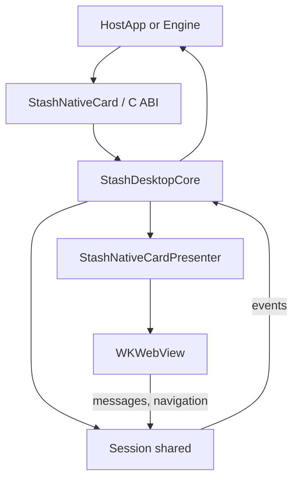

# macOS Implementation

## What The macOS Host Does

The macOS host wraps web checkout in `WKWebView`, presents it as a card or modal over the game's own window (the game keeps rendering underneath), and exposes the same `window.stash_sdk` bridge as mobile. Native apps use the Objective-C `StashNativeCard` facade with `StashNativeCardDelegate`; game engines bind the C ABI in [`Desktop/include/StashNativeDesktop.h`](../Desktop/include/StashNativeDesktop.h). Both drive one core.

Minimum platform: macOS 11 (see [`Desktop/Package.swift`](../Desktop/Package.swift)). Universal arm64 + x86_64.

## Source Files

Paths relative to repository root.

| Role | File |
|------|------|
| Public facade, delegate protocol, config types | [`Desktop/macOS/Sources/StashNativeDesktop/include/StashNativeCard.h`](../Desktop/macOS/Sources/StashNativeDesktop/include/StashNativeCard.h) |
| C ABI header of record (both OSes) | [`Desktop/include/StashNativeDesktop.h`](../Desktop/include/StashNativeDesktop.h) |
| Version | [`Desktop/include/StashNativeDesktopVersion.h`](../Desktop/include/StashNativeDesktopVersion.h) |
| Facade over the core, delegate mapping | [`Desktop/macOS/Sources/StashNativeDesktop/StashNativeCard.mm`](../Desktop/macOS/Sources/StashNativeDesktop/StashNativeCard.mm) |
| Core: session lifetime, webview factory, prewarm, event dispatch | [`Desktop/macOS/Sources/StashNativeDesktop/StashDesktopCore.mm`](../Desktop/macOS/Sources/StashNativeDesktop/StashDesktopCore.mm) |
| AppKit surface: backdrop, card, trust header, spinner, standalone window | [`Desktop/macOS/Sources/StashNativeDesktop/StashNativeCardPresenter.mm`](../Desktop/macOS/Sources/StashNativeDesktop/StashNativeCardPresenter.mm) |
| `WKNavigationDelegate` / `WKUIDelegate`, timers, crash recovery, message proxy | [`Desktop/macOS/Sources/StashNativeDesktop/StashNativeCardWebViewDelegates.mm`](../Desktop/macOS/Sources/StashNativeDesktop/StashNativeCardWebViewDelegates.mm) |
| C ABI exports | [`Desktop/macOS/Sources/StashNativeDesktop/StashNativeDesktopExports.mm`](../Desktop/macOS/Sources/StashNativeDesktop/StashNativeDesktopExports.mm) |
| Config objects and conversion to the shared config | [`Desktop/macOS/Sources/StashNativeDesktop/StashNativeCardConfigs.mm`](../Desktop/macOS/Sources/StashNativeDesktop/StashNativeCardConfigs.mm) |
| Private declarations | [`Desktop/macOS/Sources/StashNativeDesktop/StashNativeCardPrivate.h`](../Desktop/macOS/Sources/StashNativeDesktop/StashNativeCardPrivate.h) |
| Shared contract (script, URL, theme, config, session) | [`Desktop/shared/`](../Desktop/shared/) |
| Bundle build | [`Desktop/macOS/build_bundle.sh`](../Desktop/macOS/build_bundle.sh) |
| SwiftPM package (shared target, host, sample, tests) | [`Desktop/Package.swift`](../Desktop/Package.swift) |

Sample app (Swift, delegate and C ABI wiring): [`Desktop/macOS/Sample/StashNativeDesktopSample/`](../Desktop/macOS/Sample/StashNativeDesktopSample/).

## Public API Surface

Declared in [`StashNativeCard.h`](../Desktop/macOS/Sources/StashNativeDesktop/include/StashNativeCard.h): the iOS header minus the UIKit-only members (no popup, no Safari calls, no orientation API; `forcePortrait` is accepted and ignored).

- `+sharedInstance`, `+sdkVersion`, `+setInspectableWebViewsEnabled:`
- `hostWindow` (optional; key window, then main window otherwise)
- `-openCardWithURL:config:`, `-openModalWithURL:config:`, `-openBrowserWithURL:`
- `-openCardWithURL:configJSON:`, `-openModalWithURL:configJSON:` (the wrapper JSON contract, including the desktop-only keys)
- `-dismiss`, `-resetPresentationState`, `-prewarm`, `-shutdown`

Delegate callbacks: `stashNativeCardDidCompletePaymentWithOrder:`, `stashNativeCardDidFailPayment`, `stashNativeCardDidDismiss`, `stashNativeCardDidReceiveOptIn:`, `stashNativeCardDidLoadPage:`, `stashNativeCardDidEncounterNetworkError`, `stashNativeCardDidRequestExternalPaymentWithURL:`. There is no browser-closed callback on desktop.

C ABI: see [Windows Implementation](./windows.md#c-abi) for the export list; it is identical here. Every call is marshalled to the main queue; the state reads are atomic.

## Injection And Bridge Model

The script is [`Desktop/shared/StashSdkScript.h`](../Desktop/shared/StashSdkScript.h) with the WebKit prelude (`window.webkit.messageHandlers[name].postMessage`), installed as a `WKUserScript` at document start, main frame only. One `StashDesktopMessageProxy` is registered for all ten handler names on every webview the core creates (the prewarmed one included) and routes messages from the live webview to the current session.

| JS entry | Handler name (`STASH_SDK_MSG_*`) |
|----------|------|
| `onPaymentSuccess` | `stashPaymentSuccess` |
| `onPaymentFailure` | `stashPaymentFailure` |
| `onPurchaseProcessing` | `stashPurchaseProcessing` |
| `onProcessingCompleted` | `stashProcessingCompleted` |
| `setPaymentChannel` | `stashOptin` |
| `expand`, `collapse` | `stashExpand`, `stashCollapse` (no-ops on desktop) |
| `openExternalBrowser` | `stashExternalPayment` |
| `openLink` | `stashOpenLink` |
| `window.close` | `stashWindowClose` |

Dispatch is `Session::handleMessage` in [`StashDesktopSession.cpp`](../Desktop/shared/StashDesktopSession.cpp), shared with Windows.

## Runtime Architecture

The core owns one `Session` per presentation; the session keeps living until the next open so the WebKit callback that closes it can finish. Events are dispatched asynchronously on the main queue (the iOS delegate discipline) to the C callback and the delegate.

## Presentation

- Attached (default): `StashBackdropView` (40% black, click dismisses) over the host window's content view, `StashCardView` centred with 14 pt corners and the sheet colour, a 36 pt trust header (SF Symbol lock for https, host label, close button), spinner until the first load, Esc through a local event monitor, relayout on host resize. Size comes from `resolveSurfaceSize` in [`StashDesktopConfig.cpp`](../Desktop/shared/StashDesktopConfig.cpp): card 480 x 720 pt, modal 480 x 600 pt, clamped to the host minus a 24 pt margin, never below 400 x 500 pt unless the host itself is smaller, with an absolute floor of 200 x 240 pt.
- Window (`presentation: "window"` in the JSON config): a titled, resizable `NSWindow` for editor play mode. The title bar close button goes through the session like any other user dismissal.
- Browser: `NSWorkspace openURL:` with the theme parameter appended.

`allowDismiss = false` on a modal makes the close button, backdrop and Esc no-ops; `window.close()` still closes it.

## Loading, Timeout, Retry, And Error Semantics

`StashNativeCardLoadDelegate`, one per presentation:

- Stall reload after `kStallRetrySeconds` (1.25 s) up to `kMaxStallReloads` (2), not armed for `file://` checkouts; hard deadline `kNetworkDeadlineSeconds` (15 s). Constants in [`StashDesktopConfig.h`](../Desktop/shared/StashDesktopConfig.h).
- Main-frame HTTP status >= 400 before the first finished page (the first document or anything it navigates to on its own): `networkError`; after a finished page an HTTP error document is shown like any page. Redirect statuses keep the timers armed; any other response marks the initial load complete. `file:` / `data:` commits do the same. A main-frame response WebKit would download (an unshowable type or `Content-Disposition: attachment`) or hand to a plugin is refused: `networkError` before the first finished page, the shown page stays afterwards; a download WebKit starts on its own (error 102) is classified the same way.
- `pageLoaded(ms)` on the first finished main-frame navigation of the presentation.
- Load failures before the first finished page: `networkError` (a body that fails while still arriving included); afterwards: dismiss (`dialogDismissed`), as on iOS. After a web-content process death the reload counts as a first load again. `NSURLErrorCancelled` is ignored.
- Web-content process death: `webProcessCrashed` with `reloading` before the one reload, `terminal` before the `networkError` on a second death.
- JavaScript `alert` / `confirm` / `prompt` run as sheets on the presenting window; dismiss, reset, shutdown and the host window closing end an open sheet as cancelled. Esc dismisses only from the presenting window and never while a sheet is attached to it.
- The attached host window closing ends the session with `dialogDismissed`, so a later open is not refused as already presented.
- A main-frame navigation blocked by policy (`http://`, `file://` without `allowFileUrls`) before the first load: `navigationBlocked` then `networkError`; afterwards the loaded page stays.
- Sub-frames follow the same scheme policy (`http://` never, `file://` only with `allowFileUrls`): a refused frame reports `navigationBlocked` and the parent page stays, before or after the first load.

## Theming And Appearance

`systemPrefersDark` reads `NSApp.effectiveAppearance`. `theme::effectiveThemeIsDark` (custom `backgroundColor` luminance wins) decides the `theme=` parameter, the sheet colour and whether the dark-sheet script from [`StashSdkScript.h`](../Desktop/shared/StashSdkScript.h) is injected at document start and end (pins `html`/`body` background and `color-scheme`, iOS parity).

## State Model And Safety

- Double presentation: a second open while the surface is live is ignored with a log; a presented flag with nothing on screen is cleared and the open proceeds (iOS self-heal).
- Session id: delegates capture it and drop callbacks from earlier presentations.
- `closeSurface` releases the load delegate and webview on the next run-loop turn: both are often mid-callback when a session closes.
- `shutdown` resets, drops the prewarmed webview and clears the C callback. `StashNativeDesktop_Shutdown` and `StashNativeDesktop_SetEventCallback` are synchronous barriers: called off the main thread they wait for the main queue, so the callback is gone when they return (a managed domain may unload right after). The bundle is never unloaded by the engines.

## Building And Testing

- `cd Desktop && swift build && swift test`
- `Desktop/macOS/build_bundle.sh` produces `Desktop/macOS/build/StashNativeDesktop.bundle` and fails if any ABI export is missing. `STASH_SIGN_IDENTITY` signs it; the release archive is unsigned. A shipping app must re-sign the nested bundle with its own certificate before signing and notarizing the outer app: Gatekeeper validates nested code and hardened-runtime library validation rejects a bundle from another Team ID (see COMPATIBILITY.md).
- `cd Desktop && swift run StashNativeDesktopSample -stash-auto local` is the WKWebView smoke test (`secure` for the navigation policy, `remote -stash-url <url>` for a real checkout).
- Static analysis: `clang++ --analyze` over every `.mm` and `.cpp` (see `lint-macos` in [`lint.yml`](../.github/workflows/lint.yml)).

## Maintenance Notes

Any change to handler names or `window.stash_sdk` functions must update [`Desktop/shared/StashSdkScript.h`](../Desktop/shared/StashSdkScript.h), the mobile scripts, [`docs/stash-sdk-js.md`](./stash-sdk-js.md) and the shared tests. Presentation and load semantics that exist on both desktop OSes belong in the shared `Session`, not in this host.
