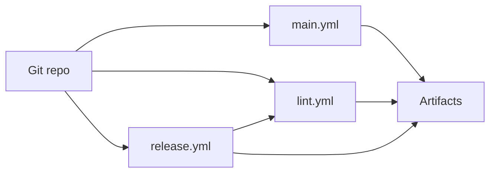

# Maintenance and Testing

## Purpose

This document defines practical maintenance workflows for build, lint, release, and verification of the Stash Native repository.

## Repository Validation Strategy

Current validation is centered on:

- Static analysis and linting.
- Platform builds and packaging.
- Sample app artifact generation.
- Cloud-device distribution for manual validation (BrowserStack/Appetize).

Unit tests run in CI (lint.yml) alongside static analysis. Coverage includes real URI parsing with Robolectric, presentation lifecycle regressions, Foundation URL handling, config defaults, and color parsing. WebView-dependent code is validated through manual testing on device/cloud.

## CI Workflows

Workflow files live under [`.github/workflows/`](../.github/workflows/).

### Main Build and Deploy

Reference: [`.github/workflows/main.yml`](../.github/workflows/main.yml)

High-level responsibilities:

- Android
  - Build AAR (`:stashnative:assembleRelease`)
  - Build sample APKs (`:sample:assembleRelease`, `:sample:assembleDebug`)
  - Upload artifacts
  - Upload/install targets to BrowserStack and Appetize
- iOS
  - Build library and sample for device/simulator
  - Produce IPA and simulator package
  - Upload artifacts
  - Upload/install targets to BrowserStack and Appetize

### Lint Workflow

Reference: [`.github/workflows/lint.yml`](../.github/workflows/lint.yml)

Includes:

- Android Checkstyle using [`Android/checkstyle.xml`](../Android/checkstyle.xml).
- Android SDK and sample unit tests, sample builds, and Android Lint.
- iOS static analysis via `xcodebuild analyze`.
- iOS unit tests (`xcodebuild test` on iOS Simulator).
- SwiftLint checks using [`.swiftlint.yml`](../.swiftlint.yml).

### Release Workflow

Reference: [`.github/workflows/release.yml`](../.github/workflows/release.yml)

Runs the reusable lint/test workflow for the same revision before publishing release artifacts:

- `StashNative-<tag>.aar`
- `StashNative-<tag>.xcframework.zip`

## Local Engineer Command Reference

Run from the repository root. Keep build outputs in a temporary source copy:

```sh
AUDIT_TEMP="${HS_TEMP:-$HOME/Temp}"
mkdir -p "$AUDIT_TEMP"
AUDIT_WORK=$(mktemp -d "$AUDIT_TEMP/stash-validation.XXXXXX")
mkdir -p "$AUDIT_WORK/source"
rsync -a --exclude='.git' --exclude='.build' --exclude='build' ./ "$AUDIT_WORK/source/"
cd "$AUDIT_WORK/source"
```

### Android

Discover an installed JDK 17 (`/usr/libexec/java_home -V` on macOS, or your package manager) and Android SDK. Set `JAVA_HOME` and `ANDROID_HOME` to those locations. Do not assume a Homebrew Cellar version. Use a compatible Android 34 platform/build tools installation.

```sh
export GRADLE_USER_HOME="$AUDIT_WORK/gradle-home"
cd Android
./gradlew :stashnative:assembleRelease :stashnative:testDebugUnitTest \
  :sample:testDebugUnitTest :sample:assembleDebug :sample:assembleRelease :stashnative:lintRelease
cd ..
```

JUnit tests using Android parsing or lifecycle APIs must use Robolectric or instrumentation. Default-returning Android stubs do not verify URI behavior. Device checks still cover browser return, activity recreation, WebView teardown, a differently signed sender APK, and R8 consumers with old/absent AndroidX Browser.

### iOS

Discover available destinations with `xcrun simctl list devices available`; set `AUDIT_SIM_ID` to an installed iOS simulator UUID. Use Xcode compatible with the declared iOS minimum. A command-line deployment override for a newer local Xcode is only a smoke check, not evidence for the release minimum.

```sh
xcodebuild build -project iOS/StashNative/StashNative.xcodeproj -scheme StashNative \
  -sdk iphoneos -derivedDataPath "$AUDIT_WORK/ios-build" CODE_SIGNING_ALLOWED=NO
xcodebuild analyze -project iOS/StashNative/StashNative.xcodeproj -scheme StashNative \
  -destination 'generic/platform=iOS Simulator' -derivedDataPath "$AUDIT_WORK/ios-analysis"
swiftlint lint iOS/Sample/StashNativeSample --strict --no-cache --config .swiftlint.yml
xcodebuild build -project iOS/Sample/StashNativeSample/StashNativeSample.xcodeproj \
  -scheme StashNativeSample -destination "platform=iOS Simulator,id=$AUDIT_SIM_ID" \
  -derivedDataPath "$AUDIT_WORK/ios-sample" CODE_SIGNING_ALLOWED=NO
```

The root `Package.swift` supports repository-URL SPM installation. To run the nested package tests without selecting the adjacent Xcode project (whose scheme has no tests), copy only the package inputs:

```sh
mkdir "$AUDIT_WORK/ios-tests"
cp iOS/StashNative/Package.swift "$AUDIT_WORK/ios-tests/"
cp -R iOS/StashNative/Sources iOS/StashNative/Tests "$AUDIT_WORK/ios-tests/"
cd "$AUDIT_WORK/ios-tests"
xcodebuild test -scheme StashNative -destination "platform=iOS Simulator,id=$AUDIT_SIM_ID" \
  -derivedDataPath "$AUDIT_WORK/ios-tests-derived"
```

Compile all Objective-C sources and a public-header consumer in both ARC and non-ARC modes. Check VoiceOver/TalkBack names, escape and adjustable actions, processing locks, rotation, and keyboard behavior on devices. See the [verification reference](../.agents/skills/stash-native-audit/references/verification.md) for additional execution contexts.

## Manual QA Surfaces

- JS bridge and callback harness: [`.github/test/index.html`](../.github/test/index.html) (exercises `window.stash_sdk`; see [JavaScript `stash_sdk` API](./stash-sdk-js.md))
- UI mockup for communication: [`.github/test/mockup.html`](../.github/test/mockup.html)
- Platform sample apps:
  - [`Android/sample/`](../Android/sample/)
  - [`iOS/Sample/StashNativeSample/`](../iOS/Sample/StashNativeSample/)

## Documentation

- Technical docs for maintainers: [`docs/README.md`](./README.md) (this folder).

## Change Management Checklist

For bridge or callback changes:

1. Update Android bridge script and `@JavascriptInterface` handlers.
2. Update iOS injected script and message handler mapping.
3. Update `.github/test/index.html` bridge calls.
4. Update API comments in public headers/docs.
5. Validate sample apps on Android and iOS simulator/device.

For release-impacting changes:

1. Verify lint workflow passes.
2. Verify main build workflow passes.
3. Confirm generated artifacts and package formats.
4. Confirm release workflow output naming and attachments.

## Infrastructure Diagram: Build and Validation Pipeline



`main.yml` also uploads builds to BrowserStack and Appetize for manual or automated device runs; see job steps in that workflow file.
