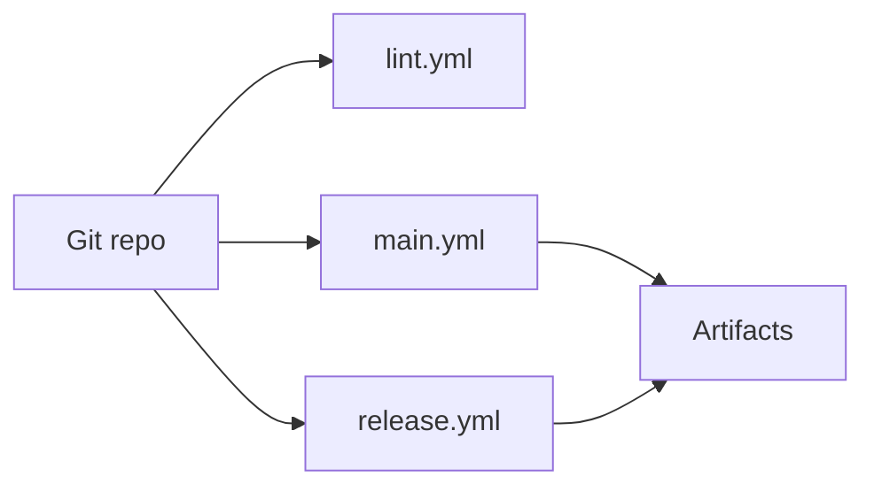

# Maintenance and Testing

## Purpose

This document defines practical maintenance workflows for build, lint, release, and verification of the Stash Native repository.

## Repository Validation Strategy

Current validation is centered on:

- Static analysis and linting.
- Platform builds and packaging.
- Sample app artifact generation.
- Cloud-device distribution for manual validation (BrowserStack/Appetize).

There is no repository-level unit/instrumentation test suite wired in CI today; quality gates are primarily lint + build + manual/device-cloud validation.

## CI Workflows

Workflow files live under [`.github/workflows/`](../.github/workflows/).

### Main Build and Deploy

Reference: [`.github/workflows/main.yml`](../.github/workflows/main.yml)

High-level responsibilities:

- Android
  - Build AAR (`:stashnative:assembleRelease`)
  - Build sample APKs (`:sample:assembleRelease`, `:sample:assembleDebug`)
  - Upload artifacts
  - Upload/install targets to BrowserStack and Appetize
- iOS
  - Build library and sample for device/simulator
  - Produce IPA and simulator package
  - Upload artifacts
  - Upload/install targets to BrowserStack and Appetize

### Lint Workflow

Reference: [`.github/workflows/lint.yml`](../.github/workflows/lint.yml)

Includes:

- Android Checkstyle using [`Android/checkstyle.xml`](../Android/checkstyle.xml).
- iOS static analysis via `xcodebuild analyze`.
- SwiftLint checks using [`.swiftlint.yml`](../.swiftlint.yml).

### Release Workflow

Reference: [`.github/workflows/release.yml`](../.github/workflows/release.yml)

Produces release artifacts:

- `StashNative-<tag>.aar`
- `StashNative-<tag>.xcframework.zip`

## Local Engineer Command Reference

### Android

- Build library:
  - `cd Android && ./gradlew :stashnative:assembleRelease`
- Build sample:
  - `cd Android && ./gradlew :sample:assembleDebug`
  - `cd Android && ./gradlew :sample:assembleRelease`
- Install sample to connected device/emulator:
  - `cd Android && ./gradlew :sample:installDebug`

### iOS

- Build library:
  - `cd iOS/StashNative && xcodebuild clean build -project StashNative.xcodeproj -scheme StashNative -configuration Release -sdk iphoneos`
- Analyze library:
  - `cd iOS/StashNative && xcodebuild analyze -project StashNative.xcodeproj -scheme StashNative -sdk iphonesimulator -destination 'generic/platform=iOS Simulator'`
- Lint sample:
  - `swiftlint lint iOS/Sample/StashNativeSample --strict --config .swiftlint.yml`
- Build sample in simulator:
  - `cd iOS/Sample/StashNativeSample && xcodebuild -project StashNativeSample.xcodeproj -scheme StashNativeSample -destination 'platform=iOS Simulator,name=iPhone 17' -configuration Debug build`

## Manual QA Surfaces

- JS bridge and callback harness: [`.github/test/index.html`](../.github/test/index.html)
- UI mockup for communication: [`.github/test/mockup.html`](../.github/test/mockup.html)
- Platform sample apps:
  - [`Android/sample/`](../Android/sample/)
  - [`iOS/Sample/StashNativeSample/`](../iOS/Sample/StashNativeSample/)

## Documentation

- Technical docs for maintainers: [`docs/README.md`](./README.md) (this folder).

## Change Management Checklist

For bridge or callback changes:

1. Update Android bridge script and `@JavascriptInterface` handlers.
2. Update iOS injected script and message handler mapping.
3. Update `.github/test/index.html` bridge calls.
4. Update API comments in public headers/docs.
5. Validate sample apps on Android and iOS simulator/device.

For release-impacting changes:

1. Verify lint workflow passes.
2. Verify main build workflow passes.
3. Confirm generated artifacts and package formats.
4. Confirm release workflow output naming and attachments.

## Infrastructure Diagram: Build and Validation Pipeline

`main.yml` also uploads builds to BrowserStack and Appetize for manual or automated device runs; see job steps in that workflow file.
