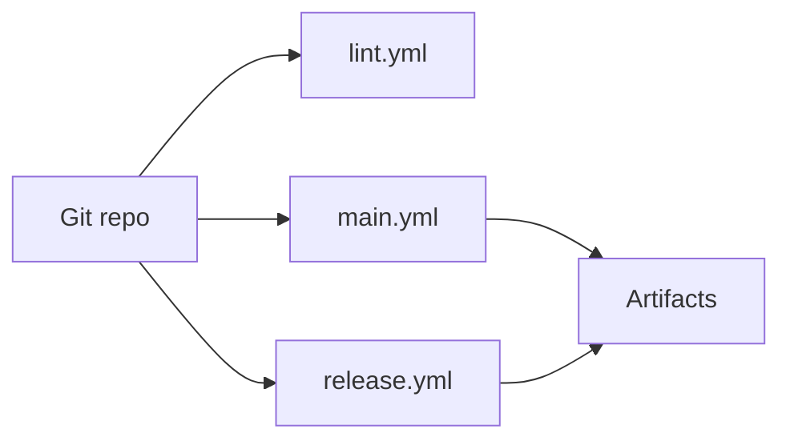

# Maintenance and Testing

## Purpose

This document defines practical maintenance workflows for build, lint, release, and verification of the Stash Native repository.

## Repository Validation Strategy

Current validation is centered on:

- Static analysis and linting.
- Platform builds and packaging.
- Sample app artifact generation.
- Cloud-device distribution for manual validation (BrowserStack/Appetize).

Unit tests run in CI (lint.yml) alongside static analysis. Coverage is focused on pure-logic utilities (URL normalization, theme parameters, config defaults, color parsing) and, on desktop, the shared `Session` callback state machine. WebView-dependent code is validated through manual testing on device/cloud; on desktop the samples' `-stash-auto` proof runs are real WKWebView / WebView2 smoke tests executed in CI.

## CI Workflows

Workflow files live under [`.github/workflows/`](../.github/workflows/).

### Main Build and Deploy

Reference: [`.github/workflows/main.yml`](../.github/workflows/main.yml)

High-level responsibilities:

- Android
  - Build AAR (`:stashnative:assembleRelease`)
  - Build sample APKs (`:sample:assembleRelease`, `:sample:assembleDebug`)
  - Upload artifacts
  - Upload/install targets to BrowserStack and Appetize
- iOS
  - Build library and sample for device/simulator
  - Produce IPA and simulator package
  - Upload artifacts
  - Upload/install targets to BrowserStack and Appetize
- Windows (`build-windows-library`, `build-windows-sample`)
  - Build `StashNativeDesktop.dll`, upload dll + import lib + headers
  - Build the Win32 sample and run `-stash-auto local` and `-stash-auto secure` (WebView2 smoke tests on `windows-latest`)
- macOS (`build-macos-library`, `build-macos-sample`)
  - `swift build`, `build_bundle.sh` with the export check, upload the bundle
  - Build the sample and run `-stash-auto local` and `-stash-auto secure` (WKWebView smoke tests)

There is no BrowserStack / Appetize equivalent for desktop; the sample smoke runs are the device-like check.

### Lint Workflow

Reference: [`.github/workflows/lint.yml`](../.github/workflows/lint.yml)

Includes:

- Android Checkstyle using [`Android/checkstyle.xml`](../Android/checkstyle.xml).
- Android unit tests (`./gradlew :stashnative:testDebugUnitTest`).
- iOS static analysis via `xcodebuild analyze`.
- iOS unit tests (`xcodebuild test` on iOS Simulator).
- SwiftLint checks using [`.swiftlint.yml`](../.swiftlint.yml) (iOS and macOS samples).
- Desktop shared contract tests (`test-desktop-shared`, ubuntu, cmake).
- macOS host: `swift build`, clang static analyzer over every `.mm` and `.cpp`, `swift test`, bundle build (`lint-macos`, `test-macos`).
- Windows host: MSVC build with warnings as errors, shared and Windows tests (`lint-windows`, `test-windows`).

Both workflows also run on pull requests targeting `desktop/**` branches so every PR of a stacked desktop branch set gets CI.

### Release Workflow

Reference: [`.github/workflows/release.yml`](../.github/workflows/release.yml)

Produces release artifacts:

- `StashNative-<tag>.aar`
- `StashNative-<tag>.xcframework.zip`
- `StashNativeDesktop-<tag>-win64.zip` (dll, import lib, headers)
- `StashNativeDesktop-<tag>-macos.zip` (universal bundle, headers)

The workflow is driven by the first `CHANGELOG.md` header and gates it against the iOS, Android and desktop version strings (see Version Management in [`CLAUDE.md`](../CLAUDE.md)).

## Local Engineer Command Reference

### Android

- Build library:
  - `cd Android && ./gradlew :stashnative:assembleRelease`
- Build sample:
  - `cd Android && ./gradlew :sample:assembleDebug`
  - `cd Android && ./gradlew :sample:assembleRelease`
- Install sample to connected device/emulator:
  - `cd Android && ./gradlew :sample:installDebug`
- Run unit tests:
  - `cd Android && ./gradlew :stashnative:testDebugUnitTest`

### iOS

- Build library:
  - `cd iOS/StashNative && xcodebuild clean build -project StashNative.xcodeproj -scheme StashNative -configuration Release -sdk iphoneos`
- Analyze library:
  - `cd iOS/StashNative && xcodebuild analyze -project StashNative.xcodeproj -scheme StashNative -sdk iphonesimulator -destination 'generic/platform=iOS Simulator'`
- Lint sample:
  - `swiftlint lint iOS/Sample/StashNativeSample --strict --config .swiftlint.yml`
- Build sample in simulator:
  - `cd iOS/Sample/StashNativeSample && xcodebuild -project StashNativeSample.xcodeproj -scheme StashNativeSample -destination 'platform=iOS Simulator,name=iPhone 17' -configuration Debug build`
- Run unit tests:
  - `cd iOS/StashNative && xcodebuild test -scheme StashNative -destination 'platform=iOS Simulator,name=iPhone 17 Pro'`

### Desktop

- Shared contract tests (any OS):
  - `cmake -S Desktop/shared -B Desktop/shared-build && cmake --build Desktop/shared-build && ctest --test-dir Desktop/shared-build`
- macOS:
  - `cd Desktop && swift build && swift test`
  - `Desktop/macOS/build_bundle.sh`
  - `cd Desktop && swift run StashNativeDesktopSample -stash-auto local` (also `secure`, `remote -stash-url <url>`)
  - `swiftlint lint Desktop/macOS/Sample/StashNativeDesktopSample --strict --config .swiftlint.yml`
- Windows (Visual Studio C++ workload):
  - `cmake -S Desktop/Windows -B Desktop/Windows/build -A x64 && cmake --build Desktop/Windows/build --config Release`
  - `ctest --test-dir Desktop/Windows/build -C Release`
  - `Desktop\Windows\build\Sample\Release\StashNativeDesktopSample.exe -stash-auto local`

## Manual QA Surfaces

- JS bridge and callback harness: [`.github/test/index.html`](../.github/test/index.html) (exercises `window.stash_sdk`; see [JavaScript `stash_sdk` API](./stash-sdk-js.md))
- UI mockup for communication: [`.github/test/mockup.html`](../.github/test/mockup.html)
- Platform sample apps:
  - [`Android/sample/`](../Android/sample/)
  - [`iOS/Sample/StashNativeSample/`](../iOS/Sample/StashNativeSample/)
  - [`Desktop/macOS/Sample/`](../Desktop/macOS/Sample/), [`Desktop/Windows/Sample/`](../Desktop/Windows/Sample/)
- Offline desktop test pages: [`Desktop/shared/test-pages/`](../Desktop/shared/test-pages/) (`stash_test_checkout.html?auto=1` drives the bridge round trip; `stash_validation_matrix.html` exercises a 3DS-style iframe and a PSP popup)
- Desktop manual gates: [Desktop Validation Matrix](./desktop-validation-matrix.md)

## Documentation

- Technical docs for maintainers: [`docs/README.md`](./README.md) (this folder).

## Change Management Checklist

For bridge or callback changes:

1. Update Android bridge script and `@JavascriptInterface` handlers.
2. Update iOS injected script and message handler mapping.
3. Update the desktop script in `Desktop/shared/StashSdkScript.h`, `Session::handleMessage` and the shared tests.
4. Update `.github/test/index.html` bridge calls.
5. Update API comments in public headers/docs.
6. Validate sample apps on Android and iOS simulator/device, and the desktop samples' `-stash-auto local` runs.

For release-impacting changes:

1. Verify lint workflow passes.
2. Verify main build workflow passes.
3. Confirm generated artifacts and package formats.
4. Confirm release workflow output naming and attachments.

## Infrastructure Diagram: Build and Validation Pipeline

`main.yml` also uploads builds to BrowserStack and Appetize for manual or automated device runs; see job steps in that workflow file.
