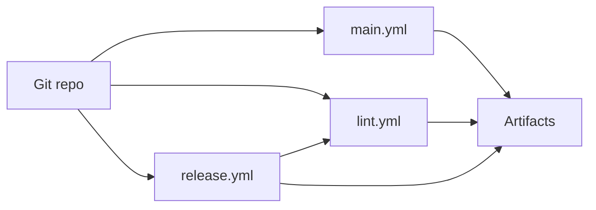

# Maintenance and Testing

## Purpose

This document defines practical maintenance workflows for build, lint, release, and verification of the Stash Native repository.

## Repository Validation Strategy

Current validation is centered on:

- Static analysis and linting.
- Platform builds and packaging.
- Sample app artifact generation.
- Cloud-device distribution for manual validation (BrowserStack/Appetize).

Unit tests run in CI (lint.yml) alongside static analysis. Coverage includes real URI parsing with Robolectric, presentation lifecycle regressions, Foundation URL handling, config defaults, and color parsing. WebView-dependent code is validated through manual testing on device/cloud.

## CI Workflows

Workflow files live under [`.github/workflows/`](../.github/workflows/).

### Main Build and Deploy

Reference: [`.github/workflows/main.yml`](../.github/workflows/main.yml)

High-level responsibilities:

- Android
  - Build AAR (`:stashnative:assembleRelease`)
  - Build sample APKs (`:sample:assembleRelease`, `:sample:assembleDebug`)
  - Upload artifacts
  - Upload/install targets to BrowserStack and Appetize
- iOS
  - Build library and sample for device/simulator
  - Produce IPA and simulator package
  - Upload artifacts
  - Upload/install targets to BrowserStack and Appetize

### Lint Workflow

Reference: [`.github/workflows/lint.yml`](../.github/workflows/lint.yml)

Includes:

- Android Checkstyle using [`Android/checkstyle.xml`](../Android/checkstyle.xml).
- Android SDK and sample unit tests, sample builds, and Android Lint.
- iOS static analysis via `xcodebuild analyze`.
- iOS unit tests (`xcodebuild test` on iOS Simulator).
- SwiftLint checks using [`.swiftlint.yml`](../.swiftlint.yml).

### Release Workflow

Reference: [`.github/workflows/release.yml`](../.github/workflows/release.yml)

Runs the reusable lint/test workflow for the same revision before publishing release artifacts:

- `StashNative-<tag>.aar`
- `StashNative-<tag>.xcframework.zip`

## Local Engineer Command Reference

Run from the repository root. Keep build outputs in a temporary source copy:

```sh
AUDIT_TEMP="${HS_TEMP:-$HOME/Temp}"
mkdir -p "$AUDIT_TEMP"
AUDIT_WORK=$(mktemp -d "$AUDIT_TEMP/stash-validation.XXXXXX")
mkdir -p "$AUDIT_WORK/source"
rsync -a --exclude='.git' --exclude='.build' --exclude='build' ./ "$AUDIT_WORK/source/"
cd "$AUDIT_WORK/source"
```

### Android

Discover an installed JDK 17 (`/usr/libexec/java_home -V` on macOS, or your package manager) and Android SDK. Set `JAVA_HOME` and `ANDROID_HOME` to those locations. Do not assume a Homebrew Cellar version. Use a compatible Android 34 platform/build tools installation.

```sh
export GRADLE_USER_HOME="$AUDIT_WORK/gradle-home"
cd Android
./gradlew :stashnative:assembleRelease :stashnative:testDebugUnitTest \
  :sample:testDebugUnitTest :sample:assembleDebug :sample:assembleRelease :stashnative:lintRelease
cd ..
```

JUnit tests using Android parsing or lifecycle APIs must use Robolectric or instrumentation. Default-returning Android stubs do not verify URI behavior. Device checks still cover browser return, activity recreation, WebView teardown, a differently signed sender APK, and R8 consumers with old/absent AndroidX Browser.

### iOS

Discover available destinations with `xcrun simctl list devices available`; set `AUDIT_SIM_ID` to an installed iOS simulator UUID. Use Xcode compatible with the declared iOS minimum. The v3 deployment target is iOS 15. Use the installed Xcode 27.1 beta via a per-command `DEVELOPER_DIR`; do not change the machine-wide selected Xcode.

```sh
export DEVELOPER_DIR=/Applications/Xcode-beta.app/Contents/Developer
xcodebuild build -project iOS/StashNative/StashNative.xcodeproj -scheme StashNative \
  -sdk iphoneos -derivedDataPath "$AUDIT_WORK/ios-build" CODE_SIGNING_ALLOWED=NO
xcodebuild analyze -project iOS/StashNative/StashNative.xcodeproj -scheme StashNative \
  -destination 'generic/platform=iOS Simulator' -derivedDataPath "$AUDIT_WORK/ios-analysis"
swiftlint lint iOS/Sample/StashNativeSample --strict --no-cache --config .swiftlint.yml
xcodebuild build -project iOS/Sample/StashNativeSample/StashNativeSample.xcodeproj \
  -scheme StashNativeSample -destination "platform=iOS Simulator,id=$AUDIT_SIM_ID" \
  -derivedDataPath "$AUDIT_WORK/ios-sample" CODE_SIGNING_ALLOWED=NO
```

The root `Package.swift` supports repository-URL SPM installation. To run the nested package tests without selecting the adjacent Xcode project (whose scheme has no tests), copy only the package inputs:

```sh
mkdir "$AUDIT_WORK/ios-tests"
cp iOS/StashNative/Package.swift "$AUDIT_WORK/ios-tests/"
cp -R iOS/StashNative/Sources iOS/StashNative/Tests "$AUDIT_WORK/ios-tests/"
cd "$AUDIT_WORK/ios-tests"
xcodebuild test -scheme StashNative -destination "platform=iOS Simulator,id=$AUDIT_SIM_ID" \
  -derivedDataPath "$AUDIT_WORK/ios-tests-derived"
```

Compile all Objective-C sources and a public-header consumer in both ARC and non-ARC modes. Check VoiceOver/TalkBack names, escape and adjustable actions, processing locks, rotation, and keyboard behavior on devices. See the [verification reference](../.agents/skills/stash-native-audit/references/verification.md) for additional execution contexts.

On iOS 26+, compact iPhone cards cancel a recognized horizontal scale-compensation spring during their initial native entrance. The correction uses public Core Animation APIs and leaves UIKit's animation untouched, but depends on an undocumented animation shape. An absent or ambiguous match keeps native behavior. Check rendered first frames, cold opening, reopening, rotation, and interrupted presentation on each new runtime; layer samples taken before the transaction commit can precede the correction for that frame.

On iOS 26+, initial loading leaves the native sheet background visible and keeps the WebView transparent until readiness succeeds. Centered sheets use the native detent's system material on iOS 26.1+, restoring its default after the reveal. The page and its matching backing color fade in together; earlier iOS versions retain the opaque loading cover. Verify light and dark appearance, Reduce Transparency, Reduce Motion, slow responses, and dismissal during loading or reveal. The readiness probe recognizes the current Stash checkout skeleton class only on the exact checkout origins. Recheck this marker when checkout markup changes; the existing foreground deadline still bounds the wait.

Checkout touches cannot dismiss the iOS card. An upward content swipe expands a resting phone card through UIKit; the native header controls interactive resizing and dismissal. The SDK's content pan takes priority over each WebKit scroll view's actual `panGestureRecognizer` when expanding or pulling past a scroll limit. It declines gestures that a touched scroll view can consume, preserving root-document and nested scrolling. A claimed edge pull lasts until the fingers lift; reversing that same touch does not restart a scroll pan that has already failed. Track all active scroll and header pans before applying deferred content heights. Keep the WebView at its full layout size without stretching its rendered surface.

Verify downward pulls at both detents, repeated upward pulls at maximum height, rapid reversals, header collapse and dismissal, keyboard entry, and long root-document and nested scrolling. Include a gesture that reaches a scroll limit without lifting. Measure sheet model geometry during the gesture and compare WebView and native surface presentation bounds; final detent assertions alone miss transient movement and gaps. Inspect rendered frames too, while preserving UIKit's glass touch feedback.

## Manual QA Surfaces

- JS bridge and callback harness: [`.github/test/index.html`](../.github/test/index.html) (exercises `window.stash_sdk`; see [JavaScript `stash_sdk` API](./stash-sdk-js.md))
- Responsive geometry and state fixture: [`.github/test/responsive.html`](../.github/test/responsive.html)
- UI mockup for communication: [`.github/test/mockup.html`](../.github/test/mockup.html)
- Platform sample apps:
  - [`Android/sample/`](../Android/sample/)
  - [`iOS/Sample/StashNativeSample/`](../iOS/Sample/StashNativeSample/)

## Documentation

- Technical docs for maintainers: [`docs/README.md`](./README.md) (this folder).

## Change Management Checklist

For bridge or callback changes:

1. Update Android bridge script and `@JavascriptInterface` handlers.
2. Update iOS injected script and message handler mapping.
3. Update `.github/test/index.html` bridge calls.
4. Update API comments in public headers/docs.
5. Validate sample apps on Android and iOS simulator/device.

For release-impacting changes:

1. Verify lint workflow passes.
2. Verify main build workflow passes.
3. Confirm generated artifacts and package formats.
4. Confirm release workflow output naming and attachments.

## Infrastructure Diagram: Build and Validation Pipeline


```mermaid
flowchart LR
    Repo[Git repo]
    Lint[lint.yml]
    Build[main.yml]
    Rel[release.yml]
    Out[Artifacts]

    Repo --> Lint
    Repo --> Build
    Repo --> Rel
    Build --> Out
    Rel --> Lint
    Lint --> Out
    Rel --> Out
```

`main.yml` also uploads builds to BrowserStack and Appetize for manual or automated device runs; see job steps in that workflow file.

## 3.0 responsive validation

The iOS sample accepts DEBUG launch arguments `-stash-url <url> -stash-mode card|browser`. Use them with `simctl launch` to open the same fixture or generated test checkout repeatedly. Keep test credentials and returned checkout URLs in private temporary files rather than source or logs.

For a local fixture, serve `.github/test` from a temporary-log-backed HTTP server. iOS Simulator reaches the host through `127.0.0.1`; Android Emulator reaches it through `10.0.2.2` (or use `adb reverse`). Only the sample should enable any local test-network exception.

Required scenarios include card intrinsic short/long sizing, explicit hints, absent/invalid/stale hints, keyboard focus, rotation, continuous window resizing, fold/hinge regions, selected-state preservation, reduced motion, processing dismissal locks, and external browser return. Preserve page-load count, input and scroll state throughout. Inspect screenshots and interact with the loaded WebView; a successful install is not a runtime pass.

Verify `stash_sdk.expand()`/`collapse()` and native grabber gestures separately on closed and open Duo. Exercise slow and fast drags in both directions, including the release and subsequent layout. Check content placement during movement, then keyboard entry and dismissal from each selected state. A successful keyboard expansion does not verify manual expansion. Confirm visible software keys in screenshots; automated text injection can hide the simulator keyboard while its accessibility container still reports a large frame. Compare resting and expanded sizes against the actual host space: a short landscape window can have only a small difference between the two stops.

`Android/modern-host` consumes the standalone AAR with target36/37 variants. Follow its README to build in a task-local SDK and Gradle cache. Validate target36 on Android16/17 and target37 on Android17. Keep the API34 sample and minimum-version checks separate.

For Android card checks, include compact and large phones, a tablet, closed/open/tabletop fold states, real split-screen divider changes, and desktop windows. Check resting, expanded, keyboard, rotation, and portrait preference over a landscape-only host. Wake and unlock the emulator after closing a fold; a suspended display is not a failed checkout load. Display-size overrides alone do not verify multi-window behavior.

For bottom-attached Android cards, compare both card and WebView bottoms against the app window's bottom, or the keyboard's top while it is open. Comparing only WebView and card bounds misses a shared gap above the navigation bar. Inspect gesture and three-button navigation in light and dark themes, including real narrow split-screen windows. The page must paint behind the navigation area; centered cards and cards above separating hinges must retain their intended boundaries. Check focused controls and scroll to the final content on the installed WebView provider as well as measuring native frames.

Record both rendered screenshots and card/WebView bounds during gestures and resizing. Downward content swipes must leave the surface stationary in both states; upward expansion must not reverse into collapse during the same touch. Exercise long root documents, nested scrollers, edge crossings, continuous reversals, and two-finger gestures. Verify handle collapse/dismissal, processing locks, explicit content heights, and typed input/document identity across resizing. Check the first cold navigation and rounded corners on the oldest provider: the SDK can work on API 21 while a checkout website requires a newer WebView engine.

Build and install minified modern-host release variants as well as debug probes. Use the sample's ordinary controls for release checks; its debug launch hook is intentionally absent. Capture a loading-to-content transition and confirm that reopening, background/return, and dismissal during loading do not leave an old fade or duplicate page-loaded callback.

Repeat Android loading captures after switching between light and dark system themes with existing checkout storage. Initial readiness checks the exact Stash checkout origins, their root theme marker, and visible skeleton placeholders before and after WebView paint. Recheck those page markers when checkout markup changes. API 21–22 use a delayed readiness recheck because they lack the native visual-state callback. The bounded foreground wait must still release a committed page if a provider never delivers its readiness callback.

Hosted macOS validation uses the available Xcode26.6 image to exercise compile guards. `.github/workflows/ios-beta.yml` accepts a runner label with Xcode27.1 beta installed, and release packaging explicitly requires that beta and SDK27.1. Set `STASH_IOS_RELEASE_RUNNER` to an appropriately provisioned runner until hosted images include it. The setup action selects an installed Xcode; it does not download one. Do not count stable-hosted CI as Duo validation.

An `Unreleased` changelog entry disables release packaging/publishing. Date the entry only when the exact revision has passed the required validation and is ready for release.
