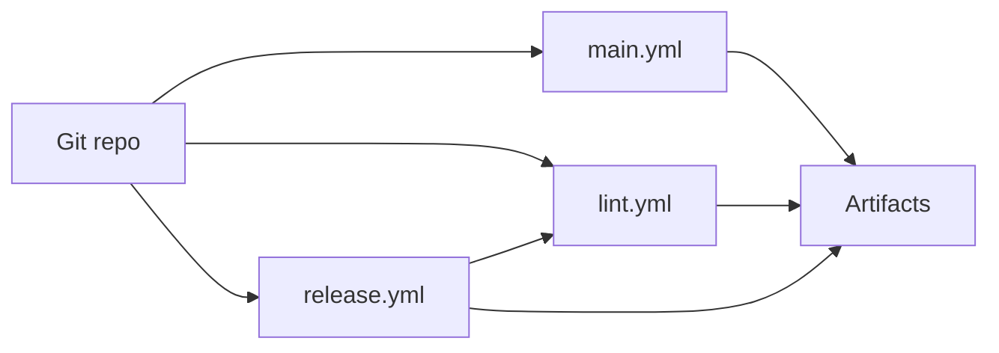

# Maintenance and Testing

## Purpose

This document defines practical maintenance workflows for build, lint, release, and verification of the Stash Native repository.

## Repository Validation Strategy

Current validation is centered on:

- Static analysis and linting.
- Platform builds and packaging.
- Sample app artifact generation.
- Cloud-device distribution for manual validation (BrowserStack/Appetize).

Unit tests run in CI (lint.yml) alongside static analysis. Coverage includes real URI parsing with Robolectric, presentation lifecycle regressions, Foundation URL handling, config defaults, color parsing, and, on desktop, the shared `Session` callback state machine. WebView-dependent code is validated through manual testing on device/cloud; on desktop the samples' `-stash-auto` proof runs are real WKWebView / WebView2 smoke tests executed in CI.

## CI Workflows

Workflow files live under [`.github/workflows/`](../.github/workflows/).

### Main Build and Deploy

Reference: [`.github/workflows/main.yml`](../.github/workflows/main.yml)

High-level responsibilities:

- Android
  - Build AAR (`:stashnative:assembleRelease`)
  - Build sample APKs (`:sample:assembleRelease`, `:sample:assembleDebug`)
  - Upload artifacts
  - Upload/install targets to BrowserStack and Appetize
- iOS
  - Build library and sample for device/simulator
  - Produce IPA and simulator package
  - Upload artifacts
  - Upload/install targets to BrowserStack and Appetize
- Windows (`build-windows-library`, `build-windows-sample`)
  - Build `StashNativeDesktop.dll`, upload dll + import lib + headers
  - Build the Win32 sample and run `-stash-auto local` and `-stash-auto secure` (WebView2 smoke tests on `windows-latest`)
- macOS (`build-macos-library`, `build-macos-sample`)
  - `swift build`, `build_bundle.sh` with the export check, upload the bundle
  - Build the sample and run `-stash-auto local` and `-stash-auto secure` (WKWebView smoke tests)

There is no BrowserStack / Appetize equivalent for desktop; the sample smoke runs are the device-like check.

### Lint Workflow

Reference: [`.github/workflows/lint.yml`](../.github/workflows/lint.yml)

Includes:

- Android Checkstyle using [`Android/checkstyle.xml`](../Android/checkstyle.xml).
- Android SDK and sample unit tests, sample builds, and Android Lint.
- iOS static analysis via `xcodebuild analyze`.
- iOS unit tests (`xcodebuild test` on iOS Simulator).
- SwiftLint checks using [`.swiftlint.yml`](../.swiftlint.yml) (iOS and macOS samples).
- Desktop shared contract tests (`test-desktop-shared`, ubuntu, cmake).
- macOS host: `swift build`, clang static analyzer over every `.mm` and `.cpp`, `swift test`, bundle build (`lint-macos`, `test-macos`).
- Windows host: MSVC build with warnings as errors, shared and Windows tests (`lint-windows`, `test-windows`).

Both workflows also run on pull requests targeting `desktop/**` branches so every PR of a stacked desktop branch set gets CI.

### Release Workflow

Reference: [`.github/workflows/release.yml`](../.github/workflows/release.yml)

Runs the reusable lint/test workflow for the same revision before publishing release artifacts:

- `StashNative-<tag>.aar`
- `StashNative-<tag>.xcframework.zip`
- `StashNativeDesktop-<tag>-win64.zip` (dll, import lib, headers)
- `StashNativeDesktop-<tag>-macos.zip` (universal bundle, headers)

The workflow is driven by the first `CHANGELOG.md` header and gates it against the iOS, Android and desktop version strings (see Version Management in [`CLAUDE.md`](../CLAUDE.md)).

## Local Engineer Command Reference

Run from the repository root. Keep build outputs in a temporary source copy:

```sh
AUDIT_TEMP="${HS_TEMP:-$HOME/Temp}"
mkdir -p "$AUDIT_TEMP"
AUDIT_WORK=$(mktemp -d "$AUDIT_TEMP/stash-validation.XXXXXX")
mkdir -p "$AUDIT_WORK/source"
rsync -a --exclude='.git' --exclude='.build' --exclude='build' ./ "$AUDIT_WORK/source/"
cd "$AUDIT_WORK/source"
```

### Android

Discover an installed JDK 17 (`/usr/libexec/java_home -V` on macOS, or your package manager) and Android SDK. Set `JAVA_HOME` and `ANDROID_HOME` to those locations. Do not assume a Homebrew Cellar version. Use a compatible Android 34 platform/build tools installation.

```sh
export GRADLE_USER_HOME="$AUDIT_WORK/gradle-home"
cd Android
./gradlew :stashnative:assembleRelease :stashnative:testDebugUnitTest \
  :sample:testDebugUnitTest :sample:assembleDebug :sample:assembleRelease :stashnative:lintRelease
cd ..
```

JUnit tests using Android parsing or lifecycle APIs must use Robolectric or instrumentation. Default-returning Android stubs do not verify URI behavior. Device checks still cover browser return, activity recreation, WebView teardown, a differently signed sender APK, and R8 consumers with old/absent AndroidX Browser.

### iOS

Discover available destinations with `xcrun simctl list devices available`; set `AUDIT_SIM_ID` to an installed iOS simulator UUID. Use Xcode compatible with the declared iOS minimum. A command-line deployment override for a newer local Xcode is only a smoke check, not evidence for the release minimum.

```sh
xcodebuild build -project iOS/StashNative/StashNative.xcodeproj -scheme StashNative \
  -sdk iphoneos -derivedDataPath "$AUDIT_WORK/ios-build" CODE_SIGNING_ALLOWED=NO
xcodebuild analyze -project iOS/StashNative/StashNative.xcodeproj -scheme StashNative \
  -destination 'generic/platform=iOS Simulator' -derivedDataPath "$AUDIT_WORK/ios-analysis"
swiftlint lint iOS/Sample/StashNativeSample --strict --no-cache --config .swiftlint.yml
xcodebuild build -project iOS/Sample/StashNativeSample/StashNativeSample.xcodeproj \
  -scheme StashNativeSample -destination "platform=iOS Simulator,id=$AUDIT_SIM_ID" \
  -derivedDataPath "$AUDIT_WORK/ios-sample" CODE_SIGNING_ALLOWED=NO
```

The root `Package.swift` supports repository-URL SPM installation. To run the nested package tests without selecting the adjacent Xcode project (whose scheme has no tests), copy only the package inputs:

```sh
mkdir "$AUDIT_WORK/ios-tests"
cp iOS/StashNative/Package.swift "$AUDIT_WORK/ios-tests/"
cp -R iOS/StashNative/Sources iOS/StashNative/Tests "$AUDIT_WORK/ios-tests/"
cd "$AUDIT_WORK/ios-tests"
xcodebuild test -scheme StashNative -destination "platform=iOS Simulator,id=$AUDIT_SIM_ID" \
  -derivedDataPath "$AUDIT_WORK/ios-tests-derived"
```

Compile all Objective-C sources and a public-header consumer in both ARC and non-ARC modes. Check VoiceOver/TalkBack names, escape and adjustable actions, processing locks, rotation, and keyboard behavior on devices. See the [verification reference](../.agents/skills/stash-native-audit/references/verification.md) for additional execution contexts.

### Desktop

- Shared contract tests (any OS):
  - `cmake -S Desktop/shared -B Desktop/shared-build && cmake --build Desktop/shared-build && ctest --test-dir Desktop/shared-build`
- macOS:
  - `cd Desktop && swift build && swift test`
  - `Desktop/macOS/build_bundle.sh`
  - `cd Desktop && swift run StashNativeDesktopSample -stash-auto local` (also `secure`, `remote -stash-url <url>`)
  - `swiftlint lint Desktop/macOS/Sample/StashNativeDesktopSample --strict --config .swiftlint.yml`
- Windows (Visual Studio C++ workload):
  - `cmake -S Desktop/Windows -B Desktop/Windows/build -A x64 && cmake --build Desktop/Windows/build --config Release`
  - `ctest --test-dir Desktop/Windows/build -C Release`
  - `Desktop\Windows\build\Sample\Release\StashNativeDesktopSample.exe -stash-auto local`

## Manual QA Surfaces

- JS bridge and callback harness: [`.github/test/index.html`](../.github/test/index.html) (exercises `window.stash_sdk`; see [JavaScript `stash_sdk` API](./stash-sdk-js.md))
- UI mockup for communication: [`.github/test/mockup.html`](../.github/test/mockup.html)
- Platform sample apps:
  - [`Android/sample/`](../Android/sample/)
  - [`iOS/Sample/StashNativeSample/`](../iOS/Sample/StashNativeSample/)
  - [`Desktop/macOS/Sample/`](../Desktop/macOS/Sample/), [`Desktop/Windows/Sample/`](../Desktop/Windows/Sample/)
- Offline desktop test pages: [`Desktop/shared/test-pages/`](../Desktop/shared/test-pages/) (`stash_test_checkout.html?auto=1` drives the bridge round trip; `stash_validation_matrix.html` exercises a 3DS-style iframe and the PSP popup handoff: window.open returns null and the checkout stays presented)
- Desktop manual gates: [Desktop Validation Matrix](./desktop-validation-matrix.md)

## Documentation

- Technical docs for maintainers: [`docs/README.md`](./README.md) (this folder).

## Change Management Checklist

For bridge or callback changes:

1. Update Android bridge script and `@JavascriptInterface` handlers.
2. Update iOS injected script and message handler mapping.
3. Update the desktop script in `Desktop/shared/StashSdkScript.h`, `Session::handleMessage` and the shared tests.
4. Update `.github/test/index.html` bridge calls.
5. Update API comments in public headers/docs.
6. Validate sample apps on Android and iOS simulator/device, and the desktop samples' `-stash-auto local` runs.

For release-impacting changes:

1. Verify lint workflow passes.
2. Verify main build workflow passes.
3. Confirm generated artifacts and package formats.
4. Confirm release workflow output naming and attachments.

## Infrastructure Diagram: Build and Validation Pipeline


```mermaid
flowchart LR
    Repo[Git repo]
    Lint[lint.yml]
    Build[main.yml]
    Rel[release.yml]
    Out[Artifacts]

    Repo --> Lint
    Repo --> Build
    Repo --> Rel
    Build --> Out
    Rel --> Lint
    Lint --> Out
    Rel --> Out
```

`main.yml` also uploads builds to BrowserStack and Appetize for manual or automated device runs; see job steps in that workflow file.
