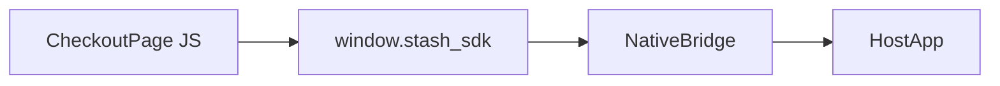

# `window.stash_sdk` JavaScript Interface

This document describes the JavaScript API injected into checkout and webshop pages loaded inside the Stash Native WebView. Web authors call these functions to report payment outcomes, adjust the native chrome, request an external browser, or close the sheet.

The native implementations are kept in lockstep on Android and iOS. Source of truth:

- Android: [`StashWebViewUtils.JS_SDK_SCRIPT`](../Android/stashnative/src/main/java/com/stash/stashnative/StashWebViewUtils.java) (constant `JS_SDK_SCRIPT`).
- iOS: `stashSDKScript` in [`StashNativeCard.m`](../iOS/StashNative/Sources/StashNative/StashNativeCard.m) (assembled `NSString` passed to `WKUserScript` at `WKUserScriptInjectionTimeAtDocumentStart`).

## Availability and Detection

The SDK defines `window.stash_sdk` if missing, then attaches functions. Pages may use:

```javascript
if (window.stash_sdk && typeof window.stash_sdk.onPaymentSuccess === 'function') {
  // running inside Stash Native WebView
}
```

Manual testing: [`.github/test/index.html`](../.github/test/index.html).

## Injection Mechanics (Summary)

| Platform | Mechanism | Bridge name |
|----------|-----------|-------------|
| Android | `WebView.evaluateJavascript(JS_SDK_SCRIPT, ...)` after WebView setup; see `injectStashSDKFunctions` in [`StashNativeCardPlugin.java`](../Android/stashnative/src/main/java/com/stash/stashnative/StashNativeCardPlugin.java) and portrait activity in [`StashNativeCardPortraitActivity.java`](../Android/stashnative/src/main/java/com/stash/stashnative/StashNativeCardPortraitActivity.java) | JavaScript interface object `StashAndroid` (`JS_INTERFACE_NAME` in [`StashWebViewUtils.java`](../Android/stashnative/src/main/java/com/stash/stashnative/StashWebViewUtils.java)) |
| iOS | `WKUserScript` at document start; `window.webkit.messageHandlers.<name>.postMessage(...)` | Handler names such as `stashNativementSuccess`, `stashExternalPayment` (constants `kMessageHandler*` in [`StashNativeCard.m`](../iOS/StashNative/Sources/StashNative/StashNativeCard.m)) |

From the page’s perspective the API is identical: only `window.stash_sdk` and `window.close` (see below).

## API Reference

All calls are wrapped in try/catch inside the injected script; exceptions in page code before the bridge call are not suppressed.

### `window.stash_sdk.onPaymentSuccess(order?)`

Signals a successful payment.

- **Argument `order` (optional):** If omitted, `undefined`, or `null`, native receives an empty payload. If a string, it is passed through. If any other type, the injected code uses `JSON.stringify(order)` before bridging.
- **Native result:** Host app receives the success listener / delegate with the string payload (or nil/empty semantics as documented in [`StashNativeCard.h`](../iOS/StashNative/Sources/StashNative/include/StashNativeCard.h) for `stashNativeCardDidCompletePaymentWithOrder:`).

Example:

```javascript
window.stash_sdk.onPaymentSuccess({ orderId: 'abc', sku: 'item_1' });
window.stash_sdk.onPaymentSuccess('plain-order-id');
```

### `window.stash_sdk.onPaymentFailure(data?)`

Signals payment failure.

- **Argument:** Passed on iOS as `data || {}` to the failure handler. Android bridge calls `onPaymentFailure()` with no serialized payload from JS (see `JS_SDK_SCRIPT`).
- **Native result:** Failure callback on the host.

> **Auto-close behavior:** By default the card / modal dismisses immediately after `onPaymentSuccess` or `onPaymentFailure`. Native integrators may opt out by setting `autoClose = false` on the card / modal config; in that case the dialog stays open after the callback fires and the host app (or `window.close()` from the page) is responsible for dismissing it. Web pages should not assume the dialog has been torn down by the time these callbacks return.

### `window.stash_sdk.onPurchaseProcessing(data?)`

Signals that a purchase is still processing. While processing, the SDK locks the card against dismissal (swipe, backdrop / overlay tap, back button, and `window.close()`) and fades out the drag handle so the sheet looks non-dismissable.

- **Argument:** iOS posts `data || {}`. Android calls `onPurchaseProcessing()` without forwarding the JS argument.
- **Native result:** Purchase-processing callback where implemented.

### `window.stash_sdk.onProcessingCompleted(data?)`

Reverses `onPurchaseProcessing`. Signals that the purchase is no longer processing: the SDK re-enables dismissal (swipe, backdrop / overlay tap, back button, and `window.close()`) and fades the drag handle back in. Call it when a purchase that previously called `onPurchaseProcessing` finishes or is cancelled without auto-closing the card.

- **Argument:** iOS posts `data || {}`. Android calls `onProcessingCompleted()` without forwarding the JS argument.
- **Native result:** Restores the dismissable card state set up before `onPurchaseProcessing`. No-op if no processing state was active.

### `window.stash_sdk.setPaymentChannel(optinType?)`

Sends opt-in or payment channel selection as a string.

- **Argument:** Coerced with `optinType || ''` (empty string if omitted).
- **Native result:** Opt-in / payment channel listener (for example `stashNativeCardDidReceiveOptIn:` on iOS).

### `window.stash_sdk.expand()`

Requests native expansion of the card chrome (sheet to full height where supported).

- **Native result:** Expand handling in the native presentation layer.

### `window.stash_sdk.collapse()`

Requests native collapse of the card chrome.

- **Native result:** Collapse handling in the native presentation layer.

### `window.stash_sdk.openExternalBrowser(url?)`

Opens the URL in the system browser flow (Chrome Custom Tabs on Android, `SFSafariViewController` on iOS per SDK behavior). The SDK validates and normalizes the URL, may append a `theme` query parameter, closes the embedded checkout without a normal dismiss callback in the external-payment path, and notifies the host.

- **Argument:** Coerced with `(url !== undefined && url !== null) ? String(url) : ''`. Invalid or disallowed URLs are rejected by native code (see `normalizeExternalPaymentUrl` in [`StashWebViewUtils.java`](../Android/stashnative/src/main/java/com/stash/stashnative/StashWebViewUtils.java) and `NormalizeExternalPaymentURL` in [`StashNativeCard.m`](../iOS/StashNative/Sources/StashNative/StashNativeCard.m)).

Host-facing semantics: [`StashNativeCard.h`](../iOS/StashNative/Sources/StashNative/include/StashNativeCard.h) documents `stashNativeCardDidRequestExternalPaymentWithURL:` for iOS.

### `window.stash_sdk.openLink(url)`

Opens the URL in the external browser and nothing else: the checkout stays presented, no host callbacks fire, no dismissal, no `theme` parameter is appended, and browser-close tracking is not armed. Intended for terms and conditions and other miscellaneous links. Use `openExternalBrowser` for the external-payment flow.

- **Argument:** Coerced with `(url !== undefined && url !== null) ? String(url) : ''`. Validated and normalized natively (http/https only, `https://` default scheme; `javascript:`/`file:`/`data:` rejected) via `normalizeExternalPaymentUrl` on Android and `NormalizeExternalPaymentURL` on iOS; invalid URLs are silently ignored.
- **Android:** `openLink` on the JS interface; opens via the system browser flow (Custom Tabs when available, otherwise `ACTION_VIEW`) without result tracking.
- **iOS:** posts `stashOpenLink`; opens via `UIApplication openURL:` (Safari app). The card remains presented and untouched.

### `window.close()`

The injected script replaces `window.close` with a function that requests closing the checkout from the native side (`requestCloseFromPage` on Android, `stashWindowClose` message on iOS).

- **Native result:** User-dismiss style flow; see delegate `stashNativeCardDidDismiss` on iOS and equivalent listener behavior on Android.

## Page Load Signaling (Not Part of `stash_sdk`)

iOS injects a separate script that posts `stashNativePageReady` for load metrics and UI reveal. Checkout pages do not call this; it is internal. See [`StashNativeCard.m`](../iOS/StashNative/Sources/StashNative/StashNativeCard.m) (`pageReadyHook`, `kMessageHandlerPageReady`).

## Platform Parity Notes

- **Failure / processing payloads:** iOS forwards object payloads via `postMessage`; Android’s injected script does not pass `data` into `onPaymentFailure` / `onPurchaseProcessing` / `onProcessingCompleted` Java methods. Pages should not rely on native interpretation of complex objects for those calls on Android unless the Android implementation is extended.
- **Naming:** Use `openExternalBrowser`, not legacy names. The script and native methods are defined in [`StashWebViewUtils.java`](../Android/stashnative/src/main/java/com/stash/stashnative/StashWebViewUtils.java) and [`StashNativeCard.m`](../iOS/StashNative/Sources/StashNative/StashNativeCard.m).

## Diagram



## Related Documentation

- [Architecture Overview](./architecture-overview.md) — high-level bridge model.
- [Android Implementation](./android.md) — `JS_SDK_SCRIPT`, `StashAndroid`, isolated process bridge.
- [iOS Implementation](./ios.md) — message handler names and delegate mapping.
- [Building Wrappers](./building-wrappers.md) — wrappers must not redefine this contract for production checkout.
