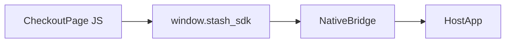

# `window.stash_sdk` JavaScript Interface

This document describes the JavaScript API injected into checkout and webshop pages loaded inside the Stash Native WebView. Web authors call these functions to report payment outcomes, adjust the native chrome, request an external browser, or close the sheet.

The native implementations are kept in lockstep on Android and iOS. Source of truth:

- Android: [`StashWebViewUtils.JS_SDK_SCRIPT`](../Android/stashnative/src/main/java/com/stash/stashnative/StashWebViewUtils.java) (constant `JS_SDK_SCRIPT`).
- iOS: `StashBridgeScript()` in [`StashNativeCardViewUtils.m`](../iOS/StashNative/Sources/StashNative/StashNativeCardViewUtils.m), installed at document start by the active session.

## Availability and Detection

The SDK defines `window.stash_sdk` if missing, then attaches functions. Pages may use:

```javascript
if (window.stash_sdk && typeof window.stash_sdk.onPaymentSuccess === 'function') {
  // running inside Stash Native WebView
}
```

Manual testing: [`.github/test/index.html`](../.github/test/index.html).

## Injection Mechanics (Summary)

| Platform | Mechanism | Bridge name |
|----------|-----------|-------------|
| Android | `WebView.evaluateJavascript` at navigation callbacks through `StashCheckoutWebViewSupport`; telemetry and card content-size support are scoped to the committed document | `StashAndroid` |
| iOS | `WKUserScript` at document start; `window.webkit.messageHandlers.<name>.postMessage(...)` | Handler names such as `stashNativementSuccess` and `stashExternalPayment`, listed by `StashScriptHandlerNames()` in [`StashNativeCardViewUtils.m`](../iOS/StashNative/Sources/StashNative/StashNativeCardViewUtils.m); `stashTelemetry` uses `WKScriptMessageHandlerWithReply` |

From the page’s perspective the API is identical: only `window.stash_sdk` and `window.close` (see below).

## API Reference

On Android existing notification calls suppress native bridge exceptions. On iOS those functions post directly (the `window.close` override is wrapped); a missing message handler would surface as a JS exception to the caller. `getTelemetry()` returns a Promise and rejects on bridge errors on both platforms. Exceptions in page code before the bridge call are never suppressed on either platform.

### `window.stash_sdk.getTelemetry()`

Returns a `Promise<Telemetry>` containing a snapshot of the device, host app, native card, and current page timing. Available inside `OpenCard` on iOS and Android; system-browser presentations do not inject this bridge.

```javascript
try {
  const telemetry = await window.stash_sdk.getTelemetry();
  console.log(telemetry.hardware.model, telemetry.timing.pageLoadTimeMs);
} catch (error) {
  // The bridge may not be ready, or the card/document may have closed.
}
```

Both platforms return every key shown below. Unsupported or unavailable values are `null`; nested objects remain present. Each call returns a new snapshot. Example iOS response:

```json
{
  "schemaVersion": 1,
  "platform": "ios",
  "hardware": {
    "manufacturer": "Apple",
    "model": "iPhone18,2",
    "memoryBytes": 8589934592
  },
  "os": {
    "version": "26.0",
    "apiLevel": null
  },
  "app": {
    "id": "com.example.game",
    "version": "2.4.0",
    "build": "42",
    "targetSdkVersion": null
  },
  "runtime": {
    "sdkVersion": "3.0.0",
    "webViewEngine": "webkit",
    "webViewPackage": null,
    "webViewVersion": null
  },
  "presentation": {
    "state": "resting",
    "keyboardVisible": false,
    "orientationPreference": "followHost",
    "portraitApplied": false,
    "window": { "width": 402, "height": 874 },
    "card": { "width": 386, "height": 560 },
    "safeAreaInsets": { "top": 62, "right": 0, "bottom": 34, "left": 0 },
    "multiWindow": null,
    "fold": { "state": null, "orientation": null, "separating": null }
  },
  "power": {
    "lowPowerMode": false,
    "thermalState": "nominal"
  },
  "timing": {
    "firstCallAt": 1791540001200,
    "pageLoadStartedAt": 1791540000000,
    "pageLoadedAt": 1791540001000,
    "pageLoadTimeMs": 1000
  }
}
```

| Field | Type | Meaning |
|---|---|---|
| `schemaVersion` | number | Payload contract version, currently `1`. Independent of the SDK version. |
| `platform` | string | `ios` or `android`. |
| `hardware.manufacturer` | string or null | `Apple` on iOS; the reported manufacturer on Android. |
| `hardware.model` | string or null | iOS hardware model identifier; Android `Build.MODEL`. Identifies a model, not an individual device. Marketing-name mapping is not included. |
| `hardware.memoryBytes` | number or null | OS-reported physical RAM. Android excludes memory reserved outside the kernel; this is not available memory or the app's memory budget. Simulators can report host-machine RAM. |
| `os.version` | string or null | Native OS release version. |
| `os.apiLevel` | number or null | Android API level; `null` on iOS. |
| `app.id` | string or null | Host game's bundle/package identifier. |
| `app.version` | string or null | Host game's release version. |
| `app.build` | string or null | iOS bundle build or Android version code, represented as a string on both platforms. |
| `app.targetSdkVersion` | number or null | Host app's Android target SDK; `null` on iOS. |
| `runtime.sdkVersion` | string | Stash Native SDK version. |
| `runtime.webViewEngine` | string | `webkit` on iOS; `chromium` on Android. |
| `runtime.webViewPackage` | string or null | Active Android WebView provider package, available from API 26; `null` on iOS and older Android versions. |
| `runtime.webViewVersion` | string or null | Provider's version name, with the same availability as `webViewPackage`. No independent WKWebView version is inferred from the user agent. |
| `presentation.state` | string or null | User/programmatic selection: `resting` or `expanded`. Temporary keyboard expansion preserves this selection. |
| `presentation.keyboardVisible` | boolean or null | Whether the native checkout currently detects a keyboard. |
| `presentation.orientationPreference` | string | Requested configuration: `followHost` or `portrait`. |
| `presentation.portraitApplied` | boolean | Whether the SDK's portrait policy is active and the checkout is currently portrait. An ignored tablet/windowed preference reports `false`. |
| `presentation.window.width`, `.height` | number or null | Current native checkout window size, including system-bar areas. |
| `presentation.card.width`, `.height` | number or null | Current native card bounds, including native chrome. |
| `presentation.safeAreaInsets.top`, `.right`, `.bottom`, `.left` | number or null | Native window safe-area/system-bar and cutout insets. Excludes keyboard occlusion. |
| `presentation.multiWindow` | boolean or null | Android's multi-window flag from API 24. `null` on iOS and older Android versions; no iPad multitasking mode is inferred from dimensions. |
| `presentation.fold.state` | string or null | Reported Android folding feature: `flat` or `halfOpened`. `null` on iOS or when no feature is reported. |
| `presentation.fold.orientation` | string or null | `vertical` or `horizontal` for the reported fold. |
| `presentation.fold.separating` | boolean or null | Whether the reported fold separates the window into distinct areas. Missing fold information does not mean the hardware cannot fold. |
| `power.lowPowerMode` | boolean or null | iOS Low Power Mode or Android Battery Saver. |
| `power.thermalState` | string or null | `nominal`, `fair`, `serious`, or `critical`. Android 10/API 29+ maps none → nominal, light/moderate → fair, severe → serious, critical/emergency/shutdown → critical. Older Android returns `null`. These are qualitative OS signals, not equivalent temperature thresholds. |
| `timing.firstCallAt` | number | Unix timestamp in milliseconds when native handles the first accepted `getTelemetry()` request in this card session. Stays fixed across later calls and navigation; a newly opened card starts a new session. |
| `timing.pageLoadStartedAt` | number or null | Unix timestamp in milliseconds of the latest top-level navigation-start callback. |
| `timing.pageLoadedAt` | number or null | Unix timestamp in milliseconds of the matching successful native page-finish callback. `null` until then. |
| `timing.pageLoadTimeMs` | number or null | Elapsed milliseconds between those native callbacks, measured using a monotonic clock. `null` until completion. |

Geometry uses iOS points and Android density-independent pixels, not CSS pixels or physical pixels. Window, card, keyboard, fold, and power fields are sampled on each request.

Full navigation, reload, retry, or WebView recovery resets the page timing fields. Duplicate completion callbacks do not change a recorded result. Failed loads leave completion fields `null`. Same-document navigation, card expansion, rotation, and resizing do not start a new page load. A page-finish callback does not guarantee that a checkout's later JavaScript hydration, images fetched after load, or native loading fade has completed. Wall-clock changes can make timestamp subtraction differ from the monotonic duration.

On Android, telemetry becomes ready when the top-level document commits, or finishes on older WebViews. Calls before readiness reject. Requests and replies are scoped to that document; stale requests cannot retrieve a replacement page's telemetry. Outstanding Android requests time out after 10 seconds. On iOS the native reply handler rejects subframe and inactive-session requests.

This API adds no permissions, entitlements, or consent prompts. It reads public native APIs and returns data to the calling page; it does not upload telemetry. It includes no advertising/device identifiers, personal device name, location, contacts, network identity, storage inspection, or installed-app inventory. Hosts remain responsible for the pages they load and any analytics collection performed by those pages.

### `window.stash_sdk.onPaymentSuccess(order?)`

Signals a successful payment.

- **Argument `order` (optional):** If omitted, `undefined`, or `null`, native receives an empty payload. If a string, it is passed through. If any other type, the injected code uses `JSON.stringify(order)` before bridging.
- **Native result:** Host app receives the success listener / delegate with the string payload (or nil/empty semantics as documented in [`StashNativeCard.h`](../iOS/StashNative/Sources/StashNative/include/StashNativeCard.h) for `stashNativeCardDidCompletePaymentWithOrder:`).

Example:

```javascript
window.stash_sdk.onPaymentSuccess({ orderId: 'abc', sku: 'item_1' });
window.stash_sdk.onPaymentSuccess('plain-order-id');
```

### `window.stash_sdk.onPaymentFailure(data?)`

Signals payment failure.

- **Argument:** Ignored. Neither platform exposes a failure payload to the host.
- **Native result:** Failure callback on the host.

> **Auto-close behavior:** By default the card dismisses immediately after `onPaymentSuccess` or `onPaymentFailure`. Native integrators may opt out by setting `autoClose = false` on the card config; in that case the dialog stays open after the callback fires and the host app (or `window.close()` from the page) is responsible for dismissing it. Web pages should not assume the dialog has been torn down by the time these callbacks return.

### `window.stash_sdk.onPurchaseProcessing(data?)`

Signals that a purchase is still processing. While processing, the SDK locks the card against dismissal (swipe, backdrop / overlay tap, back button, and `window.close()`) and fades out the drag handle so the sheet looks non-dismissable.

- **Argument:** Ignored; this call changes processing state.
- **Native result:** Purchase-processing callback where implemented.

### `window.stash_sdk.onProcessingCompleted(data?)`

Reverses `onPurchaseProcessing`. Signals that the purchase is no longer processing: the SDK re-enables dismissal (swipe, backdrop / overlay tap, back button, and `window.close()`) and fades the drag handle back in. Call it when a purchase that previously called `onPurchaseProcessing` finishes or is cancelled without auto-closing the card.

- **Argument:** Ignored; this call changes processing state.
- **Native result:** Restores the dismissable card state set up before `onPurchaseProcessing`. No-op if no processing state was active.

### `window.stash_sdk.setPaymentChannel(optinType?)`

Sends opt-in or payment channel selection as a string.

- **Argument:** Coerced with `optinType || ''` (empty string if omitted).
- **Native result:** Opt-in / payment channel listener (for example `stashNativeCardDidReceiveOptIn:` on iOS), followed by checkout closure. This is independent of payment `autoClose`.

### `window.stash_sdk.expand()`

Requests native expansion of the card chrome (sheet to full height where supported).

- **Native result:** Selects the card's expanded state, bounded by current usable space and its configured maximum.

### `window.stash_sdk.collapse()`

Requests native collapse of the card chrome.

- **Native result:** Selects the card's resting state.

### `window.stash_sdk.setContentHeight(heightInCssPixels)`

Optional intrinsic sizing hint for cards. The argument must be a finite positive number representing the full top-level checkout content height at its current layout viewport width. Include web-owned padding; exclude native chrome and safe-area padding.

The SDK converts CSS pixels to native logical units and fits the resting card within the preferred-height ceiling and available area. It preserves the selected expanded state. Invalid or stale measurements are ignored; the native bridge associates each report with the current document and viewport. Do not call native-private measurement handlers directly.

For automatic reporting, mark one intrinsic wrapper with `data-stash-content`. The card observes that element. A wrapper tied to viewport height or fixed/sticky positioning is unsuitable; generic document `scrollHeight` is not a reliable intrinsic measurement. Pages without a usable marker or hint use the configured resting height and scroll normally.

```javascript
const content = document.querySelector('#checkout');
new ResizeObserver(() => {
  window.stash_sdk?.setContentHeight(content.getBoundingClientRect().height);
}).observe(content);
```

See [responsive presentation](responsive-presentation.md) and the [responsive test page](../.github/test/responsive.html).

### `window.stash_sdk.openExternalBrowser(url?)`

Opens the URL in the system browser flow (Chrome Custom Tabs on Android, `SFSafariViewController` on iOS per SDK behavior). The SDK validates and normalizes the URL, may append a `theme` query parameter, closes the embedded checkout without a normal dismiss callback in the external-payment path, and notifies the host.

- **Argument:** Coerced with `(url !== undefined && url !== null) ? String(url) : ''`. Invalid or disallowed URLs are rejected by native code (see `normalizeExternalPaymentUrl` in [`StashWebViewUtils.java`](../Android/stashnative/src/main/java/com/stash/stashnative/StashWebViewUtils.java) and `NormalizeExternalPaymentURL` in [`StashNativeCardViewUtils.m`](../iOS/StashNative/Sources/StashNative/StashNativeCardViewUtils.m)).

Host-facing semantics: [`StashNativeCard.h`](../iOS/StashNative/Sources/StashNative/include/StashNativeCard.h) documents `stashNativeCardDidRequestExternalPaymentWithURL:` for iOS.

### `window.stash_sdk.openLink(url)`

Opens the URL in the external browser and nothing else: the checkout stays presented, no host callbacks fire, no dismissal, no `theme` parameter is appended, and browser-close tracking is not armed. Intended for terms and conditions and other miscellaneous links. Use `openExternalBrowser` for the external-payment flow.

- **Argument:** Coerced with `(url !== undefined && url !== null) ? String(url) : ''`. Validated and normalized natively (http/https only, `https://` default scheme; `javascript:`/`file:`/`data:` rejected) via `normalizeExternalPaymentUrl` on Android and `NormalizeExternalPaymentURL` on iOS; invalid URLs are silently ignored.
- **Android:** `openLink` on the JS interface; opens via the system browser flow (Custom Tabs when available, otherwise `ACTION_VIEW`) without result tracking.
- **iOS:** posts `stashOpenLink`; opens via `UIApplication openURL:` (Safari app). The card remains presented and untouched.

### Deeplink navigation (stash-pay results)

Navigations to any non-web scheme (anything other than http/https/about/blob/data/file/javascript) never load inside the checkout WebView. This applies to navigations from the main frame and from sub-frames/iframes alike, since a WebView cannot load a non-web scheme in either case:

- URLs containing `stash-pay/success`, `stash-pay/failure`, or `stash-pay/cancel` (any scheme) are consumed by the SDK and run the exact same native flows as `onPaymentSuccess` (no order payload), `onPaymentFailure`, and `window.close()` respectively - including the once-guards, `autoClose` handling, and the purchase-processing close guard.
- Every other deeplink is handed to the OS (`UIApplication openURL:` on iOS, `ACTION_VIEW` on Android) and the checkout stays presented.
- Android `intent://` URIs (Chrome intent syntax) are parsed and launched; any explicit component/selector is stripped first to prevent redirection to an internal host component. If the target app is missing, the SDK uses the intent's `browser_fallback_url` when present, otherwise opens the package's Play Store listing.
- If no app can handle a deeplink (and no fallback applies), the navigation is dropped gracefully - no crash, and the checkout stays presented.

iOS universal links: a user-tapped (link-activated) main-frame https navigation is offered to any installed app that claims it as a universal link (via `openURL:` with `UniversalLinksOnly`); if no app claims it, it loads normally in the checkout. This is gated to link activations so the initial checkout load and provider redirects always stay in the card, and it requires the target app's associated domains.

Implementation: `decidePolicyForNavigationAction` in [`StashNativeCardWebViewDelegates.m`](../iOS/StashNative/Sources/StashNative/StashNativeCardWebViewDelegates.m); `shouldOverrideUrlLoading` in [`StashCheckoutWebViewSupport.java`](../Android/stashnative/src/main/java/com/stash/stashnative/StashCheckoutWebViewSupport.java); classification in [`StashWebViewUtils.java`](../Android/stashnative/src/main/java/com/stash/stashnative/StashWebViewUtils.java).

Caveat: on Android 5-6 (API 21-23) the framework only invokes the legacy `shouldOverrideUrlLoading(WebView, String)` callback, which carries no frame information; web-scheme sub-frame navigations cannot be distinguished there, but non-web-scheme deeplinks are still intercepted.

### New windows (`target="_blank"` / `window.open`)

A WebView has no second tab, so any navigation that requests a new window - an anchor with `target="_blank"` or a `window.open(url)` call, from the main frame or an iframe - is opened in the external browser instead, and the checkout stays presented (same semantics as `openLink`: no `theme` parameter, no dismissal, no host callback). http/https URLs open in the system browser; any other scheme flows through the deeplink handling above. Empty / `about:blank` placeholder popups are dropped so the live checkout document is never replaced.

- Android: `WebView` settings enable `setSupportMultipleWindows(true)`; `WebChromeClient.onCreateWindow` captures the destination via a temporary transport `WebView` and opens it externally (`openTargetBlankWindow` in [`StashCheckoutWebViewSupport.java`](../Android/stashnative/src/main/java/com/stash/stashnative/StashCheckoutWebViewSupport.java)). The temporary WebView is destroyed after resolving the destination.
- iOS: `WKUIDelegate createWebViewWithConfiguration:forNavigationAction:` opens the destination via `UIApplication openURL:` and returns `nil` (no new `WKWebView`). See [`StashNativeCardWebViewDelegates.m`](../iOS/StashNative/Sources/StashNative/StashNativeCardWebViewDelegates.m).

### `window.close()`

The injected script replaces `window.close` with a function that requests closing the checkout from the native side (`requestCloseFromPage` on Android, `stashWindowClose` message on iOS).

- **Native result:** User-dismiss style flow, permitted only when `allowDismiss` is true and purchase processing is inactive; see delegate `stashNativeCardDidDismiss` on iOS and equivalent listener behavior on Android. Explicit host dismissal remains available regardless of these page/user guards.

## Page Load Signaling (Not Part of `stash_sdk`)

Native navigation delegates report the initial page load to the host. Resizing the presentation does not reload the document or emit another page-loaded callback. Checkout pages do not send a separate readiness message.

## Platform Parity Notes

- **Failure / processing payloads:** These calls signal state only. Neither platform interprets their optional JavaScript arguments.
- **Naming:** Use `openExternalBrowser`, not legacy names. The script and native methods are defined in [`StashWebViewUtils.java`](../Android/stashnative/src/main/java/com/stash/stashnative/StashWebViewUtils.java) and [`StashNativeCardViewUtils.m`](../iOS/StashNative/Sources/StashNative/StashNativeCardViewUtils.m).

## Diagram


```mermaid
flowchart LR
    Page[CheckoutPage JS]
    StashSdk[window.stash_sdk]
    Bridge[NativeBridge]
    App[HostApp]

    Page --> StashSdk
    StashSdk --> Bridge
    Bridge --> App
```

## Related Documentation

- [Architecture Overview](./architecture-overview.md) — high-level bridge model.
- [Android Implementation](./android.md) — `JS_SDK_SCRIPT`, `StashAndroid`, same-process activity bridge.
- [iOS Implementation](./ios.md) — message handler names and delegate mapping.
- [Building Wrappers](./building-wrappers.md) — wrappers must not redefine this contract for production checkout.
