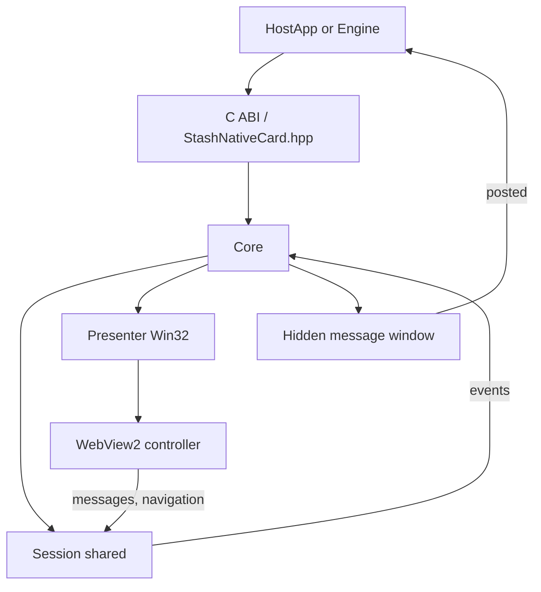

# Windows Implementation

## What The Windows Host Does

The Windows host wraps web checkout in WebView2 (Microsoft Edge Evergreen runtime), presents it as a card or modal over the game's own window and exposes the same `window.stash_sdk` bridge as mobile. Native apps and custom engines use the header-only C++ facade [`Desktop/Windows/include/StashNativeCard.hpp`](../Desktop/Windows/include/StashNativeCard.hpp); game engines bind the C ABI in [`Desktop/include/StashNativeDesktop.h`](../Desktop/include/StashNativeDesktop.h). One DLL ships (`StashNativeDesktop.dll`, static CRT, static WebView2 loader).

Minimum platform: Windows 10 1809 or Windows 11 with the WebView2 Evergreen runtime (preinstalled on Windows 11 and updated Windows 10). x64.

## Source Files

| Role | File |
|------|------|
| C++ facade (header-only over the C ABI) | [`Desktop/Windows/include/StashNativeCard.hpp`](../Desktop/Windows/include/StashNativeCard.hpp) |
| C ABI header of record (both OSes) | [`Desktop/include/StashNativeDesktop.h`](../Desktop/include/StashNativeDesktop.h) |
| Core: session lifetime, message window, host discovery, prewarm | [`Desktop/Windows/src/StashNativeCard.cpp`](../Desktop/Windows/src/StashNativeCard.cpp) |
| Win32 surface: backdrop, card, trust header, spinner, standalone window | [`Desktop/Windows/src/StashNativeCardWindow.cpp`](../Desktop/Windows/src/StashNativeCardWindow.cpp) |
| WebView2: environment, controllers, event wiring, scripts, timers | [`Desktop/Windows/src/StashNativeCardWebView.cpp`](../Desktop/Windows/src/StashNativeCardWebView.cpp) |
| Web message parsing, user data folder | [`Desktop/Windows/src/StashDesktopWebMessage.cpp`](../Desktop/Windows/src/StashDesktopWebMessage.cpp) |
| C ABI exports | [`Desktop/Windows/src/StashNativeDesktopExports.cpp`](../Desktop/Windows/src/StashNativeDesktopExports.cpp) |
| Private declarations | [`Desktop/Windows/src/StashNativeCardPrivate.hpp`](../Desktop/Windows/src/StashNativeCardPrivate.hpp) |
| CMake project (DLL, tests, sample; fetches the WebView2 SDK) | [`Desktop/Windows/CMakeLists.txt`](../Desktop/Windows/CMakeLists.txt) |
| Local build wrapper | [`Desktop/Windows/build_plugin.ps1`](../Desktop/Windows/build_plugin.ps1) |

Sample app (Win32): [`Desktop/Windows/Sample/`](../Desktop/Windows/Sample/).

## C ABI

Exported from `StashNativeDesktop.dll` and `StashNativeDesktop.bundle`, cdecl, UTF-8:

| Export | Purpose |
|--------|---------|
| `StashNativeDesktop_SetEventCallback(cb, userData)` | One callback `(type, payload, userData)` for every event |
| `StashNativeDesktop_SetHostWindow(handle)` | `HWND` / `NSWindow*`; optional |
| `StashNativeDesktop_OpenCard(url, configJson)`, `_OpenModal`, `_OpenBrowser(url)` | The three presentation modes |
| `StashNativeDesktop_Dismiss()` | Close with `dialogDismissed` |
| `StashNativeDesktop_ResetPresentationState()` | Close with no events |
| `StashNativeDesktop_IsCurrentlyPresented()`, `_IsPurchaseProcessing()` | Atomic state reads |
| `StashNativeDesktop_Prewarm()` | Browser processes and a hidden webview ahead of the first open |
| `StashNativeDesktop_SetInspectableWebViewsEnabled(int)` | DevTools / Web Inspector |
| `StashNativeDesktop_GetVersion()` | `STASH_NATIVE_DESKTOP_VERSION` |
| `StashNativeDesktop_Shutdown()` | Release the webview environment, clear the callback |

Event types: `paymentSuccess` (order or empty), `paymentFailure`, `dialogDismissed`, `optInResponse`, `pageLoaded` (ms), `networkError`, `externalPayment` (themed URL), `purchaseProcessing`, `processingCompleted`; diagnostics `navigation` (origin `scheme://host`, never the URL: it carries the signed token and wrappers log these), `navigationBlocked` (`{"url": origin, "reason"}`), `webProcessCrashed`, `error` (an opaque diagnostic message for logs, never a URL; some include an HRESULT, none are stable codes to switch on).

Config JSON: the mobile field names verbatim (`forcePortrait`, `cardHeightRatioPortrait`, ..., `allowDismiss`, `autoClose`, `backgroundColor`), plus the desktop-only `presentation` (`"attached"` | `"window"`), `width`, `height` (points) and `allowFileUrls`. Missing keys take the mobile defaults, unknown keys are ignored, ratios are clamped for parity and ignored for sizing; anything that is not one complete, well-formed JSON object (truncated, trailing text, a bad literal anywhere) falls back to the defaults entirely rather than a partial read. Parsed by `parseSurfaceConfig` in [`StashDesktopConfig.cpp`](../Desktop/shared/StashDesktopConfig.cpp).

Threading: every call must come from the thread that owns the host window's message loop (the game thread in Unity and Unreal). Events are posted through a hidden message window and delivered on that thread after the WebView2 callback that produced them has unwound; wrappers still enqueue and drain on their game loop.

## Injection And Bridge Model

The script is [`Desktop/shared/StashSdkScript.h`](../Desktop/shared/StashSdkScript.h) with the WebView2 prelude (`window.chrome.webview.postMessage({type, data})`), added with `AddScriptToExecuteOnDocumentCreated`. WebView2 runs document-created scripts in every frame, so the script returns immediately outside the top document, and `WebMessageReceived` ignores messages whose source is not the top document. [`StashDesktopWebMessage.cpp`](../Desktop/Windows/src/StashDesktopWebMessage.cpp) turns the `{type, data}` object into the message name and payload (string values unquoted, objects as JSON text); dispatch is `Session::handleMessage`, shared with macOS.

## Runtime Architecture

## Presentation

- Attached: layered backdrop child window (40% black, click dismisses) with the card's rounded rect cut out of its region so the card is never dimmed, card child window with the sheet colour, a native trust header painted in `WM_PAINT` (GDI lock glyph for https, host in Segoe UI, close button drawn from two strokes), spinner child window until the first load, the WebView2 controller inside the card below the header. A 250 ms layout timer tracks host resizes and re-applies the header and controller bounds whenever the card rect changes (the exclusive-to-borderless fullscreen switch changes size and DPI at once). The host window gets `WS_CLIPCHILDREN` for the duration.
- Window: a standalone top-level window for editor play mode; `WM_CLOSE` goes through the session.
- Browser: `ShellExecuteW` with the theme parameter appended.
- Esc: `AcceleratorKeyPressed` on the controller and `WM_KEYDOWN` on the card and standalone windows.
- `allowDismiss = false` modals get no close button; backdrop and Esc are refused by the session.

Host window: `SetHostWindow`, else the active window, else the foreground window of the process, else its largest visible window. Without one the card opens in a standalone window.

## Environment, Prewarm, And Data

- User data folder: `%LOCALAPPDATA%\Stash\<executable name>-<hash of the executable path>\WebView2` (`userDataFolderFor`): one profile per installed game, stable while the game stays where it is; two titles whose executables share a name get separate profiles. Saved payment methods are keyed per shop and user on the backend and do not depend on this folder.
- Missing runtime: `GetAvailableCoreWebView2BrowserVersionString` fails, the host emits `error` and the session ends with `networkError`.
- Prewarm creates the environment and a hidden controller navigated to `about:blank`; the first open reparents it into the card.
- Controller settings: DevTools only when inspectable, no default context menus, no status bar, no zoom control.
- Shutdown closes the session and prewarm controllers, releases the environment and clears the C callback; the header-only facade also drops its listener, so call `setListener` again before reusing the SDK (nothing is re-attached implicitly, and a callback the host installs directly through the ABI is never replaced). The DLL is never unloaded by the engines.

## Loading, Timeout, Retry, And Error Semantics

- `ContentLoading` marks the initial load complete and ends the stall and deadline timers (`TIMER_STALL` 1.25 s, up to 2 re-navigations, not armed for `file://`; `TIMER_DEADLINE` 15 s on the message window).
- `NavigationCompleted` (checkout navigation id only): a transport failure (`IsSuccess` false) before the first successful load is `networkError`, afterwards `dismiss`. An HTTP status >= 400 (`ICoreWebView2NavigationCompletedEventArgs2`) is treated as a failure on the first load only; after the initial load a completed HTTP error page stays presented, as on macOS. Success updates the trust header, hides the spinner and emits `pageLoaded` once.
- `ProcessFailed`: renderer exit or unresponsive reloads once, then `networkError`; browser process exit is terminal and releases the environment.
- `NewWindowRequested` (`target=_blank`, `window.open`): handled, external browser, checkout stays.
- Policy blocks (`http://`, `file://` without `allowFileUrls`) before the first load fail fast (`navigationBlocked`, `networkError`); afterwards the loaded page stays. `FrameNavigationStarting` applies the same scheme policy to sub-frames, where a refused frame only reports `navigationBlocked`.

## Building And Testing

- `cmake -S Desktop/Windows -B Desktop/Windows/build -A x64 && cmake --build Desktop/Windows/build --config Release` (Visual Studio C++ workload; the WebView2 SDK is downloaded from NuGet at configure time, pin with `-DSTASH_WEBVIEW2_VERSION`). `build_plugin.ps1` wraps it.
- `ctest --test-dir Desktop/Windows/build -C Release` runs the shared contract vectors and the Windows tests.
- `Desktop\Windows\build\Sample\Release\StashNativeDesktopSample.exe -stash-auto local` is the WebView2 smoke test (`secure`, `remote -stash-url <url>` as on macOS).
- CI: `lint-windows` (warnings as errors), `test-windows`, `build-windows-library`, `build-windows-sample` (with the smoke runs) on `windows-latest`.

## Maintenance Notes

Any change to `window.stash_sdk` must update [`Desktop/shared/StashSdkScript.h`](../Desktop/shared/StashSdkScript.h), the mobile scripts, [`docs/stash-sdk-js.md`](./stash-sdk-js.md) and the shared tests. Callback semantics live in the shared `Session`; this host owns Win32 and WebView2 plumbing only.
